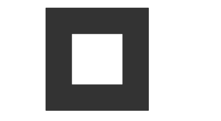
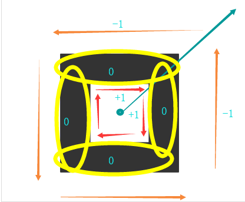
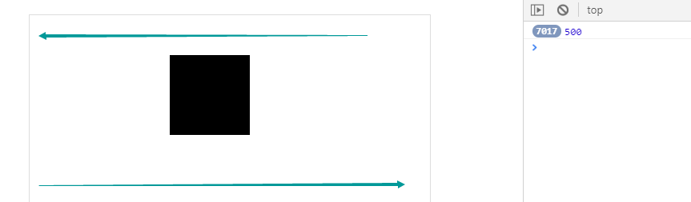

# ***标签 / 选择器***

#### **<u>标签</u>**

###### 	结构标签

​	section  定义内容块

​	header  定义头部内容

​	nav       定义导航内容

​     	article   定义页面独立的文字内容

​	aside    定义侧边栏

​	figure    定义单独块,比如图片+描述    figcaption作诶figure的标题块

​	footer    定义底部内容

###### 	特殊标签	

​	mark	文本高亮

​	meter	刻度百分比     max最高1 min最低0 optimun最佳值 heigh定义最高点 low定义最低点

​	progress	进度条

​	ruby 	文本解释

​	dialog 	消息对话框

######**IE9兼容H5标签**

- 使用 js 动态创建 语义化标签, 并且设置为块元素 `document.createElement('header')`
- 使用 `html5shiv` 插件解析html标签

```html
<!--
	1. 一定要在头部加载, 确定在使用语义化标签之前处理兼容问题
	2. 优化处理是否加载, 使用 ##条件注释## 进行判断
		<!--[if let IE8]>
			<script src="js/html5shiv.js"></script>
		<![!endif]\-\->
	3.条件注释固定写法 lt 小于 let 小于等于 gt大于 get 大于等于
-->
<html>
    <head>
        <!--[if let IE8]>
			<script src="js/html5shiv.js"></script>
		<![!endif]-->
    </head>
</html>
```

# CSS3

## 样式属性

### 背景属性

**背景图片属性**

- 背景尺寸  **background-size**

  100% 100%  	不按比例撑满盒子

  cover	      	平铺(按比例缩放,直到两边全部到头)

  contain	 	使用(按比例缩放,直到一边到头)

- 背景原点  **background-origin**

  padding-box	(默认)从内边距开始显示背景

  border-box 	(范围最大)从border区域开始

  content-box     从内容区开始

- 背景裁切  **background-clip**

  padding-box   从内边距开始裁切显示

  border-box     (默认) 从边框处裁切显示

  content-box    从内容区开始裁切显示

- 多背景应用   

  background: url() no-repeat, url() no-repeat color

- 背景的复合简写

  background: color url repeat position(位置)/size(大小) origin(原点) clip(裁切显示) attachment(fixed)

#### 背景渐变色(background-image)

​	rgba()  rgb色彩255 a透明度1

  	hsl()    h颜色360 s饱和度100% l亮度100%

###### <u>线性渐变:</u>从某个方向渐变到另一个方向

​	linear-gradient(to 方位(或角度),颜色1 颜色范围,颜色2 颜色范围)

```css
/*
	1. 开始颜色和结束颜色
	2. 渐变的方向
	3. 渐变的范围
*/
linear-gradient(
	渐变反向(to center / deg),
	颜色1 范围(yellow 10px),
	颜色2 范围(skyblue 15px)
)
```

######         <u>径向渐变:</u>从一个点向四周扩散

​	radial-gradient(半径 at 位置, 颜色1 颜色范围,颜色2 颜色范围)

```css
radial-gradient(
	半径(50px) at 位置(50px 50px /  center center / 50%  50%),
	颜色1 范围,
	颜色2 范围
)
```

###### 	<u>重复渐变</u>

​	repeating-radial-gradient()

​	repeating-linear-gradient()

###### 可设置背景大小

​	因为是背景图片的性质,所以设置background-size 可以实现背景的规律重复(未设置repeat下)


###  盒子阴影,边框圆角,文本属性

#### 边框圆角

**border-radius**: x1 x2 x3 x4 / y1 y2 y3 y4

​	边框

​		border-style	边框类型

​		border-color	边框颜色 四个值对应 上下左右

​		border-width  	边框厚度

#### 盒子阴影

**box-shadow**

​	位置x 位置y 模糊度blur 扩散距离spread 颜色rgba 内阴影inset

#### 边框背景

**border-image**( IE11 主流)

- border-image	图片资源地址
- border-image-slice   切割位置  4个顶角尺寸
- border-image-width  设定的边宽宽度
- border-image-repeat  规定顶角以外部分的平铺方式  
  - round  自适应平铺
  - stretch  拉伸
  - repeat  由中到外规则宽度平铺

```css
//css部分
.box{
    width: 500px;
    heght:100px;
    border: 20px solid #ccc;
}
.box:nth-of-type(2) {
    /* 在内容变化的容器中可以使用, 边框自动填充
    用法:*/
    /*图片资源地址  url*/
    border-image: url("images/border01.jpg");
    /*切割的尺寸,默认单位px 而且不能使用浮点数*/
    /*切割位置距离对应边的距离  4个切割尺寸*/
    border-image-slice: 167; /*167 167 167 167*/
    /*边框的宽度*/
    border-image-width: 20px;
    /*平铺的方式 三种 round stretch repeat*/
    /*round 环绕 完整的自适应(等比缩放) */
    /*stretch 拉伸, 拉伸显示 变宽内容 变形*/
    /*repeat 平铺 从边框的中间向两边填充*/
    border-image-repeat: round;
}

//html
<div class="box"></div>
```

#### 文本属性

- <u>**white-space**</u>

  nomal      默认,忽略多个空白/缩进/换行 只保留一个

  nowrap    控制文本不换行

  pre-wrap  保留空白缩进,正常换行

- <u>**word-wrap**</u>

  word-wrap: break-wrap   换行(不拆单词)

  word-break: break-all      强制换行

- <u>**direction**</u>

  rtl             文本从右往左显示

  ltr             文本从左往右显示

- <u>**unicode-bildi**</u>

  bidi-override  文字倒序显示

- <u>**单行文本省略号显示**</u>

  white-space: no-wrap

  text-overflow: ellipsis

  over-flow: hidden

- <u>**text-shadow**</u>  文字阴影

  位置x 位置y 模糊度blur 颜色rgba

  可以多组(凹凸字)

- <u>**text-stroke**</u>    文字描边

  width宽度 color颜色

- <u>**text-transform**</u> 字母大小写

  capitalize     首字母大写

  uppercase   大写

  lowercase    小写

## 选择器

#### 关联选择器

```css
 ~ 选择 某个元素之后的所有  div ~ p -> div后面的所有p
```

#### 属性选择器

```css
img[^='deg']    选择以deg开头的img标签
img[$='png']    选择以png结尾的img标签
img[*='h']      选择包含h的img标签
```

#### 伪类选择器

```css
 p:first-child     		选择p的父元素,再选择父元素的第一个为p
 p:first-of-type   		选择p的父元素,再选择父元素的第一个p
 p:last-child      		选择最后一个为p
 p:last-of-type    		选择最后一个p元素
 p:only-child      		选择仅有一个为p
 p:only-of-type    		选择仅有一个p 
 p:nth-child(2)    		选择第二个为p
 p:nth-of-type(2)  		选择第二个p
 p:nth-last-child(2)    选择倒数第二个为p
 p:nth-last-of-type(2)  选择倒数第二个p
	备注: 类似 nth-of-type(n)
		n 的取值大于等于0
		n 可以设置预定的值
			odd [选中奇数位置的元素]
			even[选中偶数位置的元素]
		n 可以是一个表达式
			an + b 的格式
```

#### 其它选择器

```css
input:enabled   /   input:disabled  选择input能/不能被操作的input
p:empty     	选择内容为空的p
p:target    	选择被锚点激活的p   (css选项卡1)
input:checked   选择被选中的单选框或者复选框  (css选项卡2)
p:first-line 	选中第一行
p:first-letter  选中第一个字符
```

#### 新增伪元素

```css
p::selection 选择被选中的文本内容
```

## ***过渡 / 动画  / 变化  / 空间***

#### <u>**过渡**</u>

​	**transition: property duration delay timing-function**

- ​	过渡属性 transition-property
- ​        过渡时间 transition-duration
- ​        过渡延迟 transition-delay
	 ​        过渡方式 transition-timing-function 		

#### **<u>动画</u>**

​	**animation: name duration delay timing-function iteration-count direction**

- ​	动画时长 animation-duration
- ​        动画延迟 animation-delay
- ​        运动方式 animation-timing-function 

- ​        动画逆波 animation-direction                    alternate  反向运动

- ​        执行次数 animation-iteration-count         infinite     无限执行

- ​        动画结束 animation-fill-mode                    forwards 保持动画最后的状态

- ​        执行状态 animation-play-state                  paused / running    暂停/继续

- ​        steps(num)                                                    x帧动画,一帧执行num次

  ```css
  animation: bgPlay 1s steps(11) infinite;/*steps 帧动画*/
  ```

#### 变化

- transform           占据文档流位置,但是变化不影响文档流布局
  -   rotate3d(x, y, z, deg)   xyz值为1则对应坐标轴旋转开启,  deg旋转的角度
  -   translate3d(x, y, z)      在各轴上的移动距离
  -   scale3d(x, y, z)           缩放 (倍)
  -   skew(x, y)                   倾斜(deg)
-   transform-origin                 变化的基点 (默认值是center center),第三个参数是在Z轴上的距离

#### 空间

​	transform-style  变化空间   preserve-3d

​        perspective       景深

#### <u>**背面隐藏**</u>

  	backface-visibility: hidden

#### <u>transfrom的硬件加速</u>  残影,回流问题等,要给运动的元素开启硬件加速

​	transform: translate3d(100px, 100px, 0px)	Z轴指定0px的位移

​        transform:translateX(100px) translateZ(0px)

​	transform-style:preserve-3d

​	backface-visibility: hidden

#### <u>**获取变化后元素位置**</u>	

```js
cssTransform(elem, 'scale', 1.2);	//设置
cssTransform(elem, 'scale')			//获取

//2个值 -> 获取  3个值 -> 设置
//前提: 想要获取 必须先用此函数设置值
function cssTransform(obj, attr, val) {
    if (!obj.transform) {
        obj.transform = {};
    }
    if (arguments.length === 3) {	//设置
        obj.transform[attr] = val;  //添加属性
        var str = '';
        for (var key in obj.transform) {
            switch (key) {
                case 'scale':
                case 'scaleX':
                case 'scaleY':
                    str += `${key}(${obj}.transform[${key}])`;
                    break;
                case 'translate':
                case 'translateX':
                case 'translateY':
                case 'translateZ':
                    str += `${key}(${obj}.transform[${key}]px)`;
                    break;
                case 'rotate':
                case 'rotateX':
                case 'rotateY':   
                    str += `${key}(${obj}.transform[${key}]deg)`;
                    break;
            }
        }
        obj.style.transform = str;
    } else {	//获取
        val = obj.transform[attr];
        if (typeof val === 'undefined') {	// 处理默认值
            if (attr == 'scale' || attr == 'translate') {
                return 0;
            } else {
                return 1;
            }
        }
        return val;
    }
}
```


#### <u>背面隐藏</u>

------

# ***Flex弹性(伸缩)布局***

<u>Flex盒子模型: 规定主轴的排列方向, 项目的对齐方式</u>

```html
<div style="display: flex;display:-webkit-flex"></div>
```

#### 父容器属性:

- **flex-direction** 	 决定主轴方向(子项目的排列方向)
  1. row 		           主轴为水平方向
  2. row-reverse              主轴为水平方向,逆向排列
  3. column                     主轴为垂直方向
  4. column                     主轴为垂直方向,你喜爱那个排列
- **flex-wrap**              决定项目是否换行
  1. wrap                         在剩余空间内垂直居中显示, 由上至下
  2. wrap-reverse            在剩余空间内垂直居中显示, 由下至上
  3.  no-wrap                   不进行换行,平均分配空间 (默认值)
- **flex-flow**                           flex-direction 和 flex-wrap 的复合简写
- **justify-content**     决定子项目在主轴上的对齐方式
  1. flex-start                   主轴起点对齐 (默认值)  
  2. flex-end                    主轴终点对齐
  3. center                       主轴中心对齐 
  4. space-around           主轴两端对齐 (两端有空隙) 
  5. space-between         主轴两端对齐 (两端无空隙)
- **align-items**            决定子项目在交叉轴上的对齐方式 (单行情况)
  1. flex-start                    交叉轴上起点对齐 (默认值)
  2. flex-end                     交叉轴上终点对齐
  3. center                        交叉轴上中心对齐
  4. baseline                     文本底部基线对齐
  5. stretch                        项目未设置宽高,高度继承,宽度由自身内容撑开  
- **align-content**        决定子项目在交叉轴上的对齐方式 (多行情况)
  1. flex-start                    交叉轴上起点对齐
  2. flex-end                     交叉轴上终点对齐
  3. center                        交叉轴上中心对齐
  4. space-around            交叉轴上两端对齐
  5. space-between          交叉轴上两端对齐

#### <u>子项目属性:</u>

- order                                 规定项目排列顺序 (num)  默认值是0  越小越靠前
- flex-grow                           规定项目的放大比例 (num) 默认值是0 占用flex容器的剩余空间(没有无效)
- flex-shrink                         规定项目的缩小比例 (num) 默认值是同步缩小(空间不足情下况), 0即不缩小,以设置值为准
- flex-basis                          规定项目在分配空间之前,项目占据容器的空间值, 默认auto,没有剩余空间的情况下,特定项目设置了固定大小, flex容器的剩余空间则会平均分配给其它项目.
- flex                                   flex-grow 和 flex-shrink 及flex-basis 的复合简写方式
- align-self                          规定项目与其它项目在交叉轴上不同的排列方式, 覆盖flex容器align-items属性

#### <u>常用技巧</u>

1. 单个子元素的绝对居中

   父元素设置    display: flex

   子元素设置    margin: auto

   ```html
   <div style="display: flex;display:-webkit-flex">
   	<div style="margin: auto"></div>
   </div>
   ```

2. 子元素1固定宽度,子元素2适应宽度

   父元素设置    display: flex

   子元素1设置   flex: 0 0 width / width: width(兼容)

   子元素2设置   flex: 1

   ```html
   <div style="display: flex;display:-webkit-flex">
   	<div style="flex: 0 0 100px"></div>
       <div style="flex: 1"></div>
   </div>
   ```

------

# ***H5新增选择和历史管理***

#### ***新增选择器***

- document.querySelector()				选择单个元素
- document.querySelectorAll()                          选择一组元素   
- document.getElementsByClassName()         通过类名选择

#### ***获取类名列表属性  classList***

```html
<div class="box a c"></div>	
```

- add()  	 							添加class
	 remove()   							删除class
	 toggle()     							切换class
- contains()                                                        判断类名是否存在返回boolean
- legth                                                                class的长度

#### ***获取自定义属性列表 dataset***

```html
<div data-key="value" data-a-b="自定义属性aB"></div>
```

- 增         element.dataset['key']= 'value'
- 删         delete element.dataset['key']
- 改         element.dataset['key'] = 'newValue'
- 查         element.dataset['key']

#### ***JSON的方法 parse,stringify***

- JSON.parse()			把字符串转化成json    字符串的属性要严格加上引号
	 JSON.stringify()		把json转化成字符串    会自动添加双引号

#### ***处理url地址 codeURI***

 <u>为了解决在网络传输数据过程中出现的编码问题 ，需要对数据进行 解码和 编码</u>

- decodeURI()				解码
- decodeURIComponent()         解码(现在都用这个了)
- encodeURI()                            编码
- encodeURIComponent()         编码(现在都用这个了)

```js
var str = 'http://localhost:63342/H5_%E4%B8%89%E6%9C%88%E4%B8%80%E5%8D%81%E5%85%AD%E5%8F%B7/H5%E9%AB%98%E7%BA%A7%E9%83%A8%E5%88%86_%E6%96%B0%E5%A2%9E%E6%96%B9%E6%B3%95%E5%92%8C%E5%8E%86%E5%8F%B2%E7%AE%A1%E7%90%86/4_codeURI.html?_ijt=tj7ntdbuveeqn4p2a4l76u91f7';
console.log(decodeURI(str));
console.log(decodeURIComponent(str));
```

#### ***base64编码  btoa&atob***

<u>加密数据 base64编码  组成部分是 0-9 a-z A-Z  / =  等64位个字符</u>

- window.btoa()				转化为base64编码   中文字符不可以直接使用(encodeURI先进行转化)
- window.atob()                          对base64编码进行解码操作

```js
var str2 = 'hello~I Love You';
console.log(window.btoa(str2));

var str = '你好~我爱你';
console.log(window.btoa(encodeURIComponent(str)));
```

#### ***历史管理 history***

<u>页面跳转才有历史管理</u>

###### PC端的历史管理,浏览器已经存在前进后退按钮.

- window.history.pushState(数据, 标题(没实现), 地址(可选))
- window.history.replaceState();
- window.onpopstate = function(){}             事件监听历史记录(后退,前进按钮):   读取数据   event.state

```js
for (var i = 0; i < aLi.length; i++) {
    aLi[i].onclick = function () {
        oRight.innerHTML = data[this.dataset['name']];
        // console.log(window.history);
        if (window.history && window.history.pushState) {
            //设置历史管理,pushState 添加历史记录
            window.history.pushState(this.dataset['name'], '小白', '#/' + this.dataset['name'])
        }
    }
}
// 监听前进 后退按钮(历史记录)，修改oRight内容
window.onpopstate = function (e) {
    console.log(e.state);
    if(e.state){
        oRight.innerHTML = data[e.state]
    }
};
```

**网易云案例实现ajax异步加载并且优化SEO**

> - 通过ajax方式渲染页面
> - 渲染页面的同时  更新网页url
> - 历史切换的监听 更新请求内容

```javascript

```


###### 移动端的历史管理: 浏览器没有前进,后退按钮.

window.history

- back() 	          相当浏览器后退按钮
	 forward()	          相当浏览器前进按钮
	 go()		          参数 0刷新  1下一页  -1上一页

------

# ***H5 新增API***

### 全屏操作

> HTML5规范允许用户自定义网页上任一元素全屏显示。

- Node.requestFullScreen() 开启全屏显示
- Node.cancelFullScreen() 关闭全屏显示
- 由于其兼容性原因，不同浏览器需要添加前缀如：(-webkit-, -moz-, -ms-, -o-)
  webkit内核浏览器：webkitRequestFullScreen、webkitCancelFullScreen，如chrome浏览器。
  Gecko内核浏览器：mozRequestFullScreen、mozCancelFullScreen，如火狐浏览器。
- document.fullScreen检测当前是否处于全屏
  不同浏览器需要添加前缀
  document.webkitIsFullScreen、document.mozFullScreen

```javascript
//  全屏操作是 dom 操作, 如果是Jq,需要转dom先
//  开启浏览器全屏  doument.documentElement.webkitRequestFullScreen()
//	关闭全屏, 统一使用 document.webkitCancelFullScreen()
```


###  操作多媒体

**`video `  `audio`**

```html
 
```


**媒体操作都是dom操作, 如果是jq必须转dom, `.get(0)`  `[0]`** 

```css
/*全屏模式下如果要隐藏默认进度条可以使用伪元素*/  
video::-webkit-media-controls {
    display: none !important;
}
/*并且设置自定义control层级为最高*/
.controls {
    /*比全屏的状态下的视频元素高*/
    z-index: 100000000000;
}
```

方法

| 方法           | 描述                                    |
| -------------- | --------------------------------------- |
| addTextTrack() | 向音频/视频添加新的文本轨道             |
| canPlayType()  | 检测浏览器是否能播放指定的音频/视频类型 |
| load()         | 重新加载音频/视频元素                   |
| **play()**     | **开始播放音频/视频**                   |
| **pause()**    | **暂停当前播放的音频/视频**             |

属性

| 属性                | 描述                                                       |
| ------------------- | ---------------------------------------------------------- |
| audioTracks         | 返回表示可用音轨的 AudioTrackList 对象                     |
| **autoplay**        | **设置或返回是否在加载完成后随即播放音频/视频**            |
| buffered            | 返回表示音频/视频已缓冲部分的 TimeRanges 对象              |
| controller          | 返回表示音频/视频当前媒体控制器的 MediaController 对象     |
| **controls**        | **设置或返回音频/视频是否显示控件（比如播放/暂停等）**     |
| crossOrigin         | 设置或返回音频/视频的 CORS 设置                            |
| currentSrc          | 返回当前音频/视频的 URL                                    |
| **currentTime**     | **设置或返回音频/视频中的当前播放位置（以秒计）**          |
| defaultMuted        | 设置或返回音频/视频默认是否静音                            |
| defaultPlaybackRate | 设置或返回音频/视频的默认播放速度                          |
| **duration**        | **返回当前音频/视频的长度（以秒计）**                      |
| **ended**           | **返回音频/视频的播放是否已结束**                          |
| error               | 返回表示音频/视频错误状态的 MediaError 对象                |
| loop                | 设置或返回音频/视频是否应在结束时重新播放                  |
| mediaGroup          | 设置或返回音频/视频所属的组合（用于连接多个音频/视频元素） |
| muted               | 设置或返回音频/视频是否静音                                |
| networkState        | 返回音频/视频的当前网络状态                                |
| **paused**          | **设置或返回音频/视频是否暂停**                            |
| playbackRate        | 设置或返回音频/视频播放的速度                              |
| played              | 返回表示音频/视频已播放部分的 TimeRanges 对象              |
| preload             | 设置或返回音频/视频是否应该在页面加载后进行加载            |
| readyState          | 返回音频/视频当前的就绪状态                                |
| seekable            | 返回表示音频/视频可寻址部分的 TimeRanges 对象              |
| seeking             | 返回用户是否正在音频/视频中进行查找                        |
| src                 | 设置或返回音频/视频元素的当前来源                          |
| startDate           | 返回表示当前时间偏移的 Date 对象                           |
| textTracks          | 返回表示可用文本轨道的 TextTrackList 对象                  |
| videoTracks         | 返回表示可用视频轨道的 VideoTrackList 对象                 |
| volume              | 设置或返回音频/视频的音量                                  |

事件

| 事件           | 描述                                         |
| -------------- | -------------------------------------------- |
| abort          | 当音频/视频的加载已放弃时                    |
| **canplay**    | **当浏览器可以播放音频/视频时**              |
| canplaythrough | 当浏览器可在不因缓冲而停顿的情况下进行播放时 |
| durationchange | 当音频/视频的时长已更改时                    |
| emptied        | 当目前的播放列表为空时                       |
| **ended**      | **当目前的播放列表已结束时**                 |
| error          | 当在音频/视频加载期间发生错误时              |
| loadeddata     | 当浏览器已加载音频/视频的当前帧时            |
| loadedmetadata | 当浏览器已加载音频/视频的元数据时            |
| loadstart      | 当浏览器开始查找音频/视频时                  |
| pause          | 当音频/视频已暂停时                          |
| play           | 当音频/视频已开始或不再暂停时                |
| playing        | 当音频/视频在已因缓冲而暂停或停止后已就绪时  |
| progress       | 当浏览器正在下载音频/视频时                  |
| ratechange     | 当音频/视频的播放速度已更改时                |
| seeked         | 当用户已移动/跳跃到音频/视频中的新位置时     |
| seeking        | 当用户开始移动/跳跃到音频/视频中的新位置时   |
| stalled        | 当浏览器尝试获取媒体数据，但数据不可用时     |
| suspend        | 当浏览器刻意不获取媒体数据时                 |
| **timeupdate** | **当目前的播放位置已更改时**                 |
| volumechange   | 当音量已更改时                               |
| waiting        | 当视频由于需要缓冲下一帧而停止               |

### 地理定位

>在 html 规范中, 增加了获取用户地理信息的API, 这样是的我们可以基于用户位置开发互联网应用, 即基于位置服务(Location BaseService)

- 获取当前地理信息

  `navigator.geolocation.getCurerentPosition(successCallback, errorCallback)`

- 重复获取当前地理信息

  `navigator.geolocation.watchPosition(successCallback, errorCallback)`

- 当成功获取地理信息后, 会调用successCallback, 并返回一个包含位置信息的对象 `position`. 

  - position.coords.**latitude** 纬度
  - position.coords.**longitude** 经度
  - position.coords.**accuracy** 精度
  - position.coords.**altitude** 海拔高度

- 当获取地理信息失败后, 会调用 errorCallback, 并且返回错误信息 error

- 在现实开发中, 通过调用第三方API (如百度地图) 来实现地理定位信息, 这些 API 都是基于用户当前位置的, 并将用位置(经/纬度) 当做参数传递, 就可以实现相应功能.

```javascript
//	获取地理定位信息
 if (navigator.geolocation) {    //  需要翻墙才能拿取当前地理位置信息.
     navigator.geolocation.getCurrentPosition(function (position) {
         /*获取地理信息成功 position 对象*/
         /*position 属性 coords 坐标对象*/
         /*coords 有经纬度属性*/
         console.log(position.coords.latitude);  //  纬度
         console.log(position.coords.longitude); //  经度
         var latitude = position.coords.latitude;
         var longitude = position.coords.longitude;

         //	调用地图定位API接口
         // .....
         
     }, function (PositionError) {
         /*获取对立信息失败 error对象*/
         console.log(PositionError)
     })
 }
```

### 读取文件

`FileRead()`  文件对象

```javascript
//创建读取文件的对象
var reader = new FileReader()	
//readAsDataURL(Blob|File) 
//读取文件并将文件以数据URI的形式保存在result属性中，返回一个基于 Base64 编码的 data-uri 对象
reader.readAsDataURL(files[0])
//readAsText(Blob|File, opt_encoding)
//返回文本字符串。默认情况下，文本编码格式是 UTF-8，可以通过可选的格式参数，指定其他编码格式的文本
//以纯文本形式读取文件，将读取到的文本保存在result属性中，第二个参数用于指定编码类型，可选的
reader.readAsText( files[0],encoding )
//readAsBinaryString(Blob|File)	IE可能不支持
//返回二进制字符串，该字符串每个字节包含一个 0 到 255 之间的整数。（已废弃）
//读取文件并将一个字符保存在result属性中，字符串的每个字符表示一字节
reader.readAsBinaryString(files)
//readAsArrayBuffer(Blob|File)	IE可能不支持
//返回一个 ArrayBuffer 对象
//读取文件并将一个包含文件内容的ArrayBuffer保存在result属性中
reader.readAsArrayBuffer(files)
```

**读取一个图片, 显示**

```javascript
 file.onchange = function () {
     var reader = new FileReader();
     reader.readAsDataURL(this.files[0]);
     reader.onload = function () {
         document.getElementById('img').src = this.result;
     }
 }
```

### 本地存储

​	sessionStorage	临时存储 从页面打开到页面关闭的时间段

​	**localStorage		永久存储(可以手动删除存储的内容) √**

​	特点: 

​		存储量限制(5M) 客户端完成, 不会请求服务器处理 

​		sessionStorage 数据是不共享的, localStorage 数据是共享的

​	**window.localStorage** 方法(永久有效):  

- setItem()	键对值方式存储数据,可以存储任何
- getItem()        以键名获取存储的值
- removeItem() 以键名删除存储的某一条数据
- clear()            删除所有的本地存储数据   

**本地储存小案例**

```html
//html
<input type="text" name="" id="user"><br>
<input type="text" name="" id="psw"><br>
<input type="button" value="登录" id="dl"><br>
<input type="button" value="忘记密码" id="forgetPSW"><br>
<input type="button" value="全部忘记" id="forgetALL">
```

```js
//js
if(window.localStorage.getItem('user')){
    user.value = window.localStorage.getItem('user');
    psw.value = window.localStorage.getItem('psw');
}
dl.onclick = function(){
    window.localStorage.setItem('user',user.value);
    window.localStorage.setItem('psw',psw.value);
}
forgetPSW.onclick = function(){
    window.localStorage.removeItem('psw');
}
forgetALL.onclick = function(){
    window.localStorage.clear();
}
```

####storage 事件

 	当数据修改或者删除的情况下, 就会触发storage事件

​	在对数据进行改变的窗口对象上是不会触发的

​	key: 修改或者删除的key值,如果调用clear(), key为null

​	newValue: 新设置的值, 如果调用removeStorage(), key为null

​	oldValue: 调用改变前的value值

​	storageArea: 当前的storage对象

​	url: 触发脚本变化的文档的url

```js
//永久存储可以做到不同窗口数据共享
//html块
<input type="checkbox" name="" value="看电影" class="inp">看电影
<input type="checkbox" name="" value="看小说" class="inp">看小说
<input type="checkbox" name="" value="爱唱歌" class="inp">爱唱歌
<input type="checkbox" name="" value="听音乐" class="inp">听音乐
<input type="checkbox" name="" value="吹牛皮" class="inp">吹牛皮
//js块
var aInp = document.querySelectorAll('.inp');
for (var i = 0; i < aInp.length; i++) {
    aInp[i].onclick = function () {
        if (this.checked) { //被选中
            window.localStorage.setItem('sel', this.value);
        } else {    //未被选中
            window.localStorage.setItem('onsel', this.value);
        }
    }
}
window.addEventListener('storage', function (e) {
    //	console.log(e);
    if (e.key == 'sel') {    
        for (var i = 0; i < aInp.length; i++) {
            if (e.newValue == aInp[i].value) {
                aInp[i].checked = true;
            }
        }
    } else if (e.key == 'onsel') {
        for (var i = 0; i < aInp.length; i++) {
            if (e.newValue == aInp[i].value) {
                aInp[i].checked = false;
            }
        }
    }
})
```

### 多线程

​	new Worker() 可以大幅度提高性能

​	基础步骤: 

​		1.创建多线程

​		2.发送数据到多线程

​		3.多线程接收并处理计算

​		4.多线程发送处理完成的数据

​		5.前端页面接收数据并且渲染

```js
// html页面 dome.html
// html
<input type='button' id="btn" value="按钮">
// js
btn.onclick = function(ev){
    var n = 50000;
	//1.创建多线程
    var worker = new Worker('worker.js');
    //2.发送数据到多线程
    worker.postMessage(n);
    //5.前端页面接收多线程发送来的数据并且进行渲染
    worker.onmessage = function(ev){
        box.innerHTML = ev.data;
    }
}
```

```js
// 多线程页面 worker.js
//3.多线程接收前端页面发送来的数据
self.onmessage = function(ev){
    //...系列计算
	var str = '';
	var n = ev.data;
	for(var i=0; i<n; i++){
        str += String.fromCharCode(i);
	}
	//4.多线程计算完毕的数据发送给前端页面
    self.postMessage(str);
}
```

### 离线储存

> HTML5中我们可以轻松的构建一个离线（无网络状态）应用，只需要创建一个cache manifest文件。

- 优势
  - 1、可配置需要缓存的资源
  - 2、网络无连接应用仍可用
  - 3、本地读取缓存资源，提升访问速度，增强用户体验
  - 4、减少请求，缓解服务器负担
- 缓存清单
  - 一个普通文本文件，其中列出了浏览器应缓存以供离线访问的资源，推荐使用.appcache为后缀名
  - 例如我们创建了一个名为demo.appcache的文件，然后在需要应用缓存在页面的根元素(html)添加属性manifest="demo.appcache"，路径要保证正确。
- manifest文件格式
  - 1、顶行写CACHE MANIFEST
  - 2、CACHE: 换行 指定我们需要缓存的静态资源，如.css、image、js等
  - 3、NETWORK: 换行 指定需要在线访问的资源，可使用通配符
  - 4、FALLBACK: 换行 当被缓存的文件找不到时的备用资源
- 其它
  - 1、CACHE: 可以省略，这种情况下将需要缓存的资源写在CACHE MANIFEST
  - 2、可以指定多个CACHE: NETWORK: FALLBACK:，无顺序限制
  - 3、#表示注释，只有当demo.appcache文件内容发生改变时或者手动清除缓存后，才会重新缓存。
  - 4、chrome 可以通过chrome://appcache-internals/工具和离线（offline）模式来调试管理应用缓存

基础步骤: 

​	1.html标签设置manifest = "xx.appcache"

```html
<html manifest="cache.appcache">
```

​	2.创建文件 缓存清单 文件, 设置离线存储的内容

```manifest
CACHE MANIFEST

CACHE:

#此部分写需要缓存的资源 （#是注释的意思）

./images/img1.jpg
./images/img2.jpg
./images/img3.jpg
./images/img4.jpg


NETWORK:

#此部分要写需要有网络才可访问的资源，无网络刚不访问

./js/main.js

*

FALLBACK:

#当访问不到某个资源的情况下，自动由另一个资源替换

./css/online.css ./css/offline.css

./online.html ./offline.html
```

### 网络状态

- 我们可以通过window.onLine来检测，用户当前的网络状况，返回一个布尔值
  - window.online 用户网络连接时被调用
  - window.offline 用户网络断开时被调用

```javascript
//	通过window.navigartor.onLine 可以返回档期啊你的网络状态
console.log(window.navigartor.onLine);

//	事件的监听
window.addEventListener('online', function(){
    alert('网络已连接')
})
window.addEventListener('offline', function(){
    alert('网络已断开')
})
```


---

# ***H5 拖拽***

应用场景:

​	图片上传: 如提供身份证件等

```html
//	拖拽元素设置标签属性开启拖拽
<div id="box" draggable="true">我是能被进行拖拽盒子<div>
```

```js
//	拖拽一个盒子
box.ondragover = function (e) {
    this.style.cssText = 'left:' + (e.clientX - 50) + 'px;top:' + (e.clientY - 50) + 'px;';
}
```

#### ***拖拽 7 属性***

- 拖拽元素属性:
  1. ondragstart	拖拽瞬间触发
  	. ondrag   		拖拽前/后触发
  3. ondragend       拖拽结束触发


- 目标元素属性:

  1. ondragenter 	进入目标元素触发
  2. ondragover      进入目标元素连续触发
  3.  ondragleave    离开目标元素触发
  4. ondrop             在目标元素上释放鼠标触发

√ 默认情况下一个元素是不能放在另外一个元素上的,要使ondrop生效,需要阻止ondragover的默认事件(e.preventDefault())

#### ***拖拽兼容***

<u>火狐需要设置dataTransfer对象才可以拖拽除了图片以外的其它标签</u>

```js
box.ondragstart = function(e){
    e.dataTransfer.setData('abc',this)
}
```

#### ***dataTransfer 对象***

- setData()  设置数据,key和value.必须是字符串
- getData()  获取数据,根据key值获取对应value
- setDragImage(指定图标,坐标轴X,坐标轴Y)  设置拖拽元素的图标
- files          文件列表,第0个文件对象 ->  files[0]文件详细信息

#### ***new FileReader() 文件对象*** 

- new FileReader().readAsDataURL(e.dataTransfer.files[0])  分析文件url地址
- new FileReader().result  保存着分析结果

#### ***文件获取(外部文件拖拽至节点对应区域)***

```js
/*
	1.	box 默认事件(图片拖拽到浏览器会打开新窗口显示图片)的阻止
	2.	e.dataTansfer.files[0] 文件详情信息对象
	3.	new FileReader() 	文件分析对象
*/

box.ondragover = function(e){
	e.preventDefault();
	e.stopPropagation();				//阻止冒泡，火狐新标签页打开图片(火狐兼容)
}
box.ondrop = function(e){
    e.preventDefault();
    e.stopPropagation();				//阻止冒泡，火狐新标签页打开图片(火狐兼容)
            /*  e.dataTransfer.files[0] 文件列表的第0个对象 -> 保存着文件详细信息
            *	e.dataTransfer.files[0].name 文件名称
            *	e.dataTransfer.files[0].size 文件大小
            *	e.dataTransfer.files[0].type 文件类型(是图片则可以作显示图片的操作)
            *	e.dataTransfer.files[0].lastModified 文件最后修改时间对象.
            */
    var file = e.dataTransfer.files[0];
    box.innerHTML = file.name + '<br>'+ (file.size / 1024 / 1024).toFixed(2) + 'MB' + '<br>' + file.type + file.lastModified;
            /*	new FileReader() 文件分析对象
            *   new FileReader().readAsDataURL() 分析url地址
            *	new FileReader().readAsDataURL(e.dataTransfer.files[0]) 分析文件信息 -> base64的编码
            */
    var rander = new FileReader();
    rander.readAsDataURL(file); 		//分析url地址
    rander.onload = function(){
        if(/imge/.test(this.result)){	//rander.result 保存着被分析的结果
            var img = new Image();
            img.src = this.result;
            img.onload = function(){
                box.appendChild(img);
            }
        }
    }
}
```

### 


------

# ***元数据处理***

#### <u>ArrayBuffer</u>

前端方面只要是处理大数据或者想提高数据处理性能，那一定是少不了 ArrayBuffer对象

`ArrayBuffer` 表示二进制数据的原始缓冲区，该缓冲区用于存储各种类型化数组的数据。

```
Int8Array             8位有符号整数
Uint8Array            8位无符号整数
Uint8ClampedArray	  同上，像素操作
Int16Array            
Uint16Array
Int32Array
Uint32Array
Float32Array
Float64Array
以上是Typed Array类型化数组，类型化数组类型表示可编制索引和操纵的 ArrayBuffer 对象 的各种视图。 所有数组类型的长度均固定。而DataView视图对象对数据的操作更加细致
```

`ArrayBuffer`是一个固定长度的字节序列，通过`new ArrayBuffer(length)`来得到一片空间，内部实现与数组应该是不一样（内存分配和布局与Array不一样），`ArrayBuffer`是连续内存，因此对于高密度的访问（如音频数据）操作而言它比JS中的Array速度会快很多

`ArrayBuffer`是不能直接被访问的，因此需要借助Typed Array

`Typed Array` 不直接存放任何数据,多有对其进行读写的操作,最终都会落实到它背后所持有的 `ArrayBuffer`身上.`ArrayBuffer`才是真正的元数据字节,`Typed Array`只是一个操作窗口/视图(View)

#### <u>获取二进制数据</u>

- XMLHttpRequest2
- File
- Blob

在火狐下拖拽元素需要用setData函数设置键值对，同时用getData函数可以获取key的value值，那么IE定义了 text和url 这两种有效的数据类型，可以获取本网页上文本和图片路径

e.dataTransfer.getData('url')	获取 url

e.dataTransfer.getData('Text')	获取文本

它们都可以借助 FileReader 将`Blob`读取为更为实用的数据类型去使用

```
new FileReader()
	readAsArrayBuffer()	
	readAsBinaryString() 
	readAsDataURL() 	
	readAsText()		
```

#### <u>各种类型</u>

H5对此也支持，并扩展了各种 `MIME` 类型，这两种类型会被映射为 'text/plain'和'text/uri-list'

```
兼容 var dataTransfer = e.dataTransfer
获取 URL
	var url = dataTransfer.getData('url') || dataTransfer.getData('text/uri-list')
获取 文本
	var url = dataTransfer.getData('Text') || dataTransfer.getData('text/plain')
```

```
MIME 类型
MIME (Multipurpose Internet Mail Extensions) 是描述消息内容类型的因特网标准。
MIME 消息能包含文本、图像、音频、视频以及其他应用程序专用的数据。
不同的应用程序支持不同的 MIME 类型。
MIME 类型大约有191种类型，是的没错，191种^.^
```

```
Base64 类型
Base64是网络上最常见的用于传输8Bit字节码的编码方式之一，Base64就是一种基于64个可打印字符来表示二进制数据的方法
Base64编码是从二进制到字符的过程中，可用于在HTTP环境下传递较长的标识信息
```

#### <u>FileReader文件对象</u>

FileReader API 用于读取文件，即把文件内容读入内存，是一种异步文件读取机制，它的参数是 File 对象或 Blob 对象。对于不同类型的文件，FileReader 提供不同的方法读取文件。

```js
//创建读取文件的对象
var reader = new FileReader()	

//readAsDataURL(Blob|File) 
//读取文件并将文件以数据URI的形式保存在result属性中，返回一个基于 Base64 编码的 data-uri 对象
reader.readAsDataURL(files[0])

//readAsText(Blob|File, opt_encoding)
//返回文本字符串。默认情况下，文本编码格式是 UTF-8，可以通过可选的格式参数，指定其他编码格式的文本
//以纯文本形式读取文件，将读取到的文本保存在result属性中，第二个参数用于指定编码类型，可选的
reader.readAsText( files[0],encoding )

//readAsBinaryString(Blob|File)	IE可能不支持
//返回二进制字符串，该字符串每个字节包含一个 0 到 255 之间的整数。（已废弃）
//读取文件并将一个字符保存在result属性中，字符串的每个字符表示一字节
reader.readAsBinaryString(files)

//readAsArrayBuffer(Blob|File)	IE可能不支持
//返回一个 ArrayBuffer 对象
//读取文件并将一个包含文件内容的ArrayBuffer保存在result属性中
reader.readAsArrayBuffer(files)
```


#### <u>FileList对象</u> 

​	当用户通过 ***file 控件*** 选取文件后，这个控件的 this.files 属性值就是 FileList 对象。是个***类数组***，带上multiple 属性用户可选取多个文件，否则只能选择一个元素。

```js
<input type='file' multiple id='oInput'/>
<script>
    oInput.onchange = function() {
      	console.log(this.files)
    };
</script>    
```

```js
//拖拽也可以获取  FileList 对象
<script>
    box.ondrop = function(e){
        e.preventDefault();
        e.stopPropagation();			
        var files = e.dataTransfer.files[0];
        console.log(files);
    }
</script>
```

在表单选择文件或者拖拽文件中，用户通过事件触发，只能被动地读取FileList 文件列表

#### <u>Blob对象</u>  

file对象的父类型是Blob对象， Blob对象代表了一段二进制数据，提供了一系列操作接口

生产Blob对象的方法：

​	使用 Blob 构造函数

​	对现有的 Blob 对象使用 slice 方法切出一部分

```js
//Blob 构造函数，接受两个参数。
//第一个参数是一个包含实际数据的数组
//第二个参数是数据的类型
//这两个参数都不是必需的
var arr = ["hello", "world"]
var Blob = new Blob(arr, { "type" : "text/xml" })
console.log(Blob)
```

```js
//Blob 对象的 slice 方法，将二进制数据按照字节分块，返回一个新的 Blob 对象
var arr = ["hello", "world"]
var Blob = new Blob(arr, { "type" : "text/xml" })
var newBlob = Blob.slice(0, 5)
console.log(newBlob)
//Blob 对象有两个只读属性：
//size：二进制数据的大小，单位为字节。（文件上传时可以在前端判断文件大小是否合适）
//type：二进制数据的 MIME 类型，全部为小写，如果类型未知，则该值为空字符串。（文件上传时可以在前端判断文件类型是否合适）
//gbk编码：   数字字母 一字节 1KB= 1024字节 一中文汉字是 2字节
//UTF-8编码： 数字字母 一字节 1KB= 1024字节 一个中文汉字是 3字节
```

###### <u>Silce读取部分内容</u>	

有时候我们读取一部分而不是全部内容，Filereader对象支持一个slice( )方法，在火狐中用mozSlice( )，在chrome中webkitSilde( ), 这个方法返回一个Blob实例，Blog是File类型的父类型，Blog类型有一个size属性和一个type属性，它也支持slice方法，以便进一步切割数据，通过FileReader也可以从Blob中读取数据

```js
function blogSlice( blob,start,end ){
    if( blog.slice ){
		return blob.slice(start,end)
    }else if( blob.webkitSlice ){
      	return blob.webkitSlice(start,end)
    }else if( blob.mozSlice ){
    	return blob.mozSlice(start,end)         
    }else{
      	return null
    }
}
```

blob类型读取FileReader的20B内容, 只读取文件的一部分可以节省时间，非常适合只关注数据中某个特定部分（如文件文件）的情况

```js
var reader = new FileReader()
var blob = blogSlice( e.dataTransfer.files[0] , 0 , 20 )
reader.readAsText( blob )
if( blob ){
   	reader.onload = function(){
		box.innerHTML = this.result
	}
}else{
  	alert('no data')
}
```

#### <u>对象URL</u>	

对象URL也被称为 blob URL，指的是引用保存在File或Blob中数据的URL，使用对象URL的好处是没必要把内容读取到js中，而直接使用文件内容，能生成一个链接.

```js
box.ondrop = function (e) {
    e.preventDefault();
    e.stopPropagation();
    var oFiles = e.dataTransfer.files[0];
    var url = window.URL.createObjectURL(oFiles) || window.webkitURL.createObjectURL(oFiles) || null;
    //url -> blob:http://localhost:63342/af2e3048-e3f9-4c21-ad61-b2503ccd553c
    box.innerHTML += ''
    //window.URL 指向内存中的URL地址,url就表示图片的信息
    //这样做事为了不让二进制数据渲染到页面或不存放到js中, 有利提高性能
    /*	
    var rander = new FileReader();
    rander.readAsDataURL(oFiles);
    rander.onload = function () {
    	var url = rander.result;
    	//url -> base64编码
    	box.innerHTML += ''
    };
    */
}
```

#### <u>应用</u>

```js
//把ArrayBuffer转化成blob
var arrB = new ArrayBuffer(12);
console.log(arrB);
var blob = new Blob([arrB],{"type":"text/xml"})
console.log(blob);

//把类型化数组转化成blob
/*var arrB = new ArrayBuffer(12);
var arr16 = new Int8Array(arrB);
var arr32 = new Int32Array(arrB);
// console.log(arr16, arr32);
var blob = new Blob(arr16, {"type": 'text/plain'})
console.log(blob)*/
```

```js
//把canvas转换成blob对象
var cvs = document.createElement('canvas');
cvs.style.border = '1px solid red';
var ctx = cvs.getContext('2d');
ctx.fillRect(0, 0, 350, 120);
ctx.fillStyle = 'green';
ctx.fillRect(50, 50, 100, 50);
document.body.appendChild(cvs);
cvs.toBlob(function (blob) {
    var reader = new FileReader();
    reader.readAsDataURL(blob,'utf-8');
    reader.onload = function (ev) {
        console.log(this.result);
        var  img = new Image();
        img.src = this.result;
        document.body.appendChild(img);
    }
});
```

```js
//乱来...
var cvs = document.createElement('canvas');
cvs.style.border = '1px solid red';
var ctx = cvs.getContext('2d');
ctx.fillRect(0, 0, 350, 120);
ctx.fillStyle = 'green';
ctx.fillRect(50, 50, 100, 50);
document.body.appendChild(cvs);
cvs.toBlob(function (blob) {
    // console.log(blob)
    /*var reader = new FileReader();
    reader.readAsDataURL(blob,'utf-8');
    reader.onload = function (ev) {
        console.log(this.result);
        var  img = new Image();
        img.src = this.result;
        document.body.appendChild(img);
    }*/

    /*var img = new Image();
    img.src =  window.URL.createObjectURL(blob);
    document.body.appendChild(img)*/
});
//直接转换url地址,base64
var dataURL = cvs.toDataURL();
var img = new Image();
img.src = dataURL;
document.body.appendChild(img)
```


------

# ***ajax***

#### <u>下载文件</u>

​	使用a标签, href为文件地址, 图片/文本等不能直接使用a标签下载, 需要进行一波操作.压缩文件可直接上.

```js
<input type="button" id="btn1" value="点击下载图片"><br>
btn1.onclick = function () {
    var a = document.createElement('a');
    a.href = './other/1.jpg';
    a.download = '';	/*指定文件类型及命名*/
    a.click();
}
```


#### <u>ajax</u>

​	向后端发送一个请求,后端收到请求返回数据到前端,前端接收后渲染到页面中

​	跨域:

​		从一个域名,访问另一个域名,出于安全角度,浏览器不允许这么做,所以正常情况 不能请求到数据. 

​		解决方式: 后端解决

​	get/post的区别:

 		get:更常用 更方便 明文发送数据,相对而言不太安全,传输数据,大小有限制.

​		post:使用场景相对较少,性能没有get高, 比get安全,没有传输数据大小限制.

​	ajax: 不能在中文路径使用,在服务端运行.

###### <u>ajax基础步骤</u>

```js
/*创建Ajax对象*/
var xhr = new XMLHttpRequest();
/*请求目标路径*/
xhr.open('get', './other/1.php', true);
/*发送请求*/
xhr.send();
/*onload 监听 HTML5推荐使用,代替文档加载完毕*/
xhr.onload = function () {
    if (xhr.readyState == 4) {
        if (xhr.status == 200) {
            JSON.parse(xhr.responseText).forEach((item, i) => {
                console.log(item)
            })
        }
    }
};
```

###### <u>文件上传</u>

```js
<input type="file" id="fInp"><!--multiple 允许上传多个文件-->
<input type="button" id="btn" value="点击上传">
/*
*   ① 通过表单控件file获取的是input的value值，这是字符串，不是上传的文件
    ② 通过控件中的文件列表对象
        1) fInp.files获取是集合
        2) 我们的需求是通过AJax把input.files[0]数据发送到后端，但需要后端配合
        3) 通过控制台查看相关的属性和属性的值，可以通过for in循环
        4) 然后通过Ajax进行发送上传的文件
* */
btn.onclick = function () {
    /*for (var i = 0; i < fInp.files.length; i++) {
        console.log(fInp.files[i].name);
    }*/
    var xhr = new XMLHttpRequest();
    xhr.onload = function () {};
    console.log(xhr.upload);
    var oUpload = xhr.upload;
    oUpload.onprogress = function (e) {	/*上传进度条*/
        console.log('当前进度' + e.loaded, '总进度' + e.total);
    };
    xhr.open('post', './other/postFile.php', true);
    //1.构建FormData对象 提交数据
    var formData = new FormData;
    //2.通过append对象 注入到formData 对象中
    formData.append('file',fInp.files[0]);
    //3.通过ajax 把formData 对象发送到后端, 后端解决文件真实上传的问题
    xhr.send(formData);
}
```

###### <u>ajax的 封装</u>

```js
// 使用示例
Ajax({
    	type: 'POST',
    	url:"./Ajax_fz.text",
    	aysn:true,
    	data:{
			"name": "小白",
             "age": 18,
             "hobby": "口瓦伊女孩"
         },
		success:function(msg){
			var data = JSON.parse(msg);
			console.log(data);
		},
		error:function(status){
			console.log(status);
		}
	});
/*
参数json所需要的属性：
	* type:string 可缺省(默认"GET"),代表请求的方式
	* url:string 不可缺省,代表请求的地址
	* aysn:bool 可缺省,(默认 true),代表是否异步
	* data:json 可缺省,代表需要传递的数据
	* success:function 可缺省,代表成功的回调函数,该函数第一个形参代表后台返回的数据
	* error:function 可缺省,代表失败的回调函数
*/
function Ajax(json){
	var type = json.type || "GET",//默认get方式请求
		url = json.url,
		aysn = json.aysn !== false,//默认异步
		data = json.data,
		success = json.success,
		error = json.error;
	//将json格式的data处理成string格式
	data = data && (function(){
		var dataStr = '';
		for (var key in data)dataStr += key + '=' + data[key] + '&';
			dataStr += '_='+new Date().getTime();//防止低版本IE的get请求缓存问题
		return dataStr;
	})();
	//让get请求的url之后跟上数据
	if( data && /get/i.test(type) ){
		url += "?"+(data||'')+'_='+new Date().getTime();
		data = undefined;//get方式发送send(null)
	}
	//ajax主体
    var xhr = XMLHttpRequest?(new XMLHttpRequest()):(new ActiveXObject('Microsoft.XMLHTTP'));
	xhr.open(type,url,aysn);
	xhr.setRequestHeader('Content-Type','application/x-www-form-urlencoded');
	xhr.send(data);
	xhr.onload = function(){
		if(this.readyState == 4){//判断xhr请求状态成功(4)
			var status = this.status,
				response = this.responseText;
			if(status >= 200 && status < 300){
				success && success(response);
			}else{
				error && error(status);
			}
		}
	};
}
```
###### <u>ajax请求show源api接口</u>

```js
function formatterDateTime() {
    var date = new Date();
    var month = date.getMonth() + 1;
    var datetime = date.getFullYear() + "" + (month >= 10 ? month : "0" + month)
    + "" + (date.getDate() < 10 ? "0" + date.getDate() : date.getDate())
    + "" + (date.getHours() < 10 ? "0" + date.getHours() : date.getHours())
    + "" + (date.getMinutes() < 10 ? "0" + date.getMinutes() : date.getMinutes())
    + "" + (date.getSeconds() < 10 ? "0" + date.getSeconds() : date.getSeconds());
    return datetime;
};
$.ajax({
    type: 'post',
    dataType: 'json',
    url: 'http://route.showapi.com/341-3',
    data: {
        'showapi_appid': '60697',	/*用户ID*/
        'showapi_sign': 'f1449950dac94178a96e7262e8d1c0b2',  /*用户密匙*/
        'showapi_timestamp': formatterDateTime(),	/*时间*/
        'page': txt.value,
        'maxResult': 20
    },
    success: function (result) {
        console.log(result)
        alert(result.showapi_res_code)
    }
});
```
------

# ***Canvas***

#### 什么是Canvas?

​	在渲染复杂的动效/把数据可视化图形显示等都会用到canvas技术, 比 dom 操作性能更高.

​	环境 2d  	getContext('2d')

​	画布默认大小 宽300 高150, 一般是通过标签属性修改值, 否则会根据比例进行缩放.

​	绘画矩形, 如果有边框的情况下,从x轴的指定位置开始绘制, 边框线是在x位置向两边延伸.

```html
<!--1.准备画布-->
<!--2.准备回执工具-->
<!--3.利用工具绘图-->

<!--默认300*150-->
<canvas width="500" height="500"></canvas>

<script>
    /*1.获取画布元素*/
	var c = document.querySelector('canvas');
    /*2.获取上下文 绘制工具箱*/
    var cxt = c.getContext('2d');   //  绘制环境的设定
    /*3.移动画笔*/
    cxt.moveTo(100, 100);
    /*4.绘制直线*/
    cxt.lineTo(200,100);
    /*5.描边*/
    cxt.stroke();
</script>
```

####  绘制样式属性 / 绘制方式 

```js
/*样式属性
	fillStyle   填充颜色
    strokeStyle 笔触颜色
    lineWidth   笔触宽度
  绘制方式  
    stroke() 	 以边框线方式绘制图形
	fill()		以填充方式绘制图形
*/
    cxt.fillStyle = 'skyblue';      //  填充颜色
    cxt.lineWidth = 4;              //  笔触宽度
	//cxt.strokeStyle;			   //  笔触颜色
    cxt.rect(10,100,100,50);        
    cxt.stroke();                   //  以绘边框形式绘制需要的的笔触
    cxt.fill();                     //  以填充形式绘制需要的填充样式
    /*  stroke和fill都有的情况下,后者会覆盖前者的样式  */
```

####  绘制线条 

- lineWidth 线宽, 默认1px
- lineCap 线末端类型 butt(默认) round square
- lineJoin 相交的拐点 miter(默认) round bevel
- strokeStyle 线的颜色
- fillStyle  填充颜色
- setLineDash() 设置虚线
- getLineDash() 获取虚线宽度集合
- lineDashOffset 设置虚线偏移量 (负值向右偏移)

```js
/*
	moveTo(x,y)	从x,y位置开始绘制
	lineTo(x,y)	绘制到x,y位置
	setLineDash([]) 设置虚线排列方式
	getLineDash() 获取虚线排列方式
	lineDashOffset 设置虚线偏移位置
	strokeStyle() 线条颜色填充
*/
cxt.beginPath(); 	// 表示开始路径,一般用于切断线条与线条的关系
cxt.moveTo(100, 50);
cxt.lineTo(100, 200);
console.log(cxt.getLineDash())
cxt.setLineDash([5,5,10])
cxt.closePath();	// 闭合路径，一般用于链接开始到结束的连线
```

**关于线条的问题**

默认宽度是1px,默认黑色. **产生2px颜色变浅** 的原因是对齐的点是线的中心位置, 相当于把线分成两个0.5px, 显示的时候会不饱和, 浏览器默认显示1px, 所以会增加宽度, 颜色也变浅了.

解决: **前后移动0.5px **

```javascript
cxt.moveTo(100.5, 100.5);
```


#### 绘制矩形

```js
/* 
	rect(x,y,w,h)	绘制矩形
	fillRect()		绘制填充矩形
	strokeRect() 	绘制描边矩形
	clearRect() 	清除矩形选区   √
*/
cxt.lineWidth = 3;              //  设置线宽 一般指定整数
cxt.rect(10, 100, 100, 50);     //  绘制矩形,如果有边框线的情况下,从x轴为10的位置开始绘制,边框线是在x为10的位置向两边延伸
/* cxt.fillRect(10,100,100,50); */	 //此创建矩形的方式不需要再声明fill()
/* cxt.strokeRect(10,100,100,50); */ //此创建矩形的方式不需要再声明stroke()
cxt.stroke();                   //  创建笔触
```

#### 图形路径

###### 路径

```js
/*
	beginPath()	开始路径,一般用于切断图形关系
	closePath() 结束路径,链接起始位置和结束位置
*/
cxt.beginPath();	//	开始路径的绘制
cxt.strokeStyle = "#333";
cxt.moveTo(100,100);
cxt.lineTo(100,200);
cxt.lineTo(200,100);
cxt.closePath();	//	闭合路径
cxt.stroke();
```

###### 封闭路径

```js
/*  继承性, 默认是下面会继承可以继承的属性.
	save() 		保存路径
	restore() 	恢复路径, 回复上次save保存的路径
	在闭合路径中绘制仍会继承自上面传递的可继承属性
*/
	cxt.save();                 //	保存该次路径
    cxt.beginPath();
    cxt.translate(250, 250);    //  重新定义原点坐标,会被继承的属性
    cxt.scale(0.5, 0.5);        //  缩放, 有顺序影响,会被继承的属性
    cxt.arc(0, 0, 100, 0, 2 * Math.PI, false);
    cxt.closePath();
    cxt.stroke();
    cxt.restore();              // 恢复路径

    cxt.beginPath();
    cxt.strokeStyle = '#000';
    cxt.translate(100, 100);
    cxt.moveTo(0, 0);
    cxt.lineTo(100, 0);
    cxt.closePath();
    cxt.stroke();
```

####  图形边界属性 

```js
/*
lineJoin 		闭合图形连接处样式
	round	圆角
	bevel 	斜角
lineCap 		非闭合图形边界样式
	round 	圆角
	square 	高度延伸线宽的一半
*/
cxt.lineJoin = 'round';	//闭合图像连接处表现
cxt.lineCap = 'square';	//非闭合图形端点表现
cxt.beginPath();
cxt.moveTo(100, 50);
cxt.lineTo(100, 200);
cxt.lineTo(200, 200);
cxt.closePath();
cxt.stroke();
```

#### 非零环绕原则

> 绘制一个如下图形
>
> 1. 看一块区域是否填充
> 2. 从这个区域拉一条直线
> 3. 看和这条直线相交的轨迹
> 4. 如果是顺序针轨迹 +1
> 5. 如果是逆时针规矩 -1
> 6. 计算轨迹总和 如果非0 则填充, 是0. 



```
#	条件
	1. 绘制的是一个闭合图形
	2. 在绘制的时候, 出现逆时针和顺时针两个方向
#	非零环绕原则
	1.任意找一点, 越简单越好
	2.以点为原心, 绘制一条射线(相交的边越少越好)
	3.以射线为半径顺时针旋转, 相交的边同向记+1, 反向记-1, 如果相交的区域等于0, 则不填充
	4.非零区域填充
```



```html
<canvas width="500" height="350" style="border:1px solid #ddd;margin:50px auto;display: block"></canvas>
<script>
    var canvas = document.querySelector('canvas')
    var ctx = canvas.getContext('2d');
    ctx.fillStyle = '#333';
    ctx.moveTo(100, 100)
    ctx.lineTo(100, 300)
    ctx.lineTo(300, 300)
    ctx.lineTo(300, 100)
    ctx.closePath()
    ctx.stroke()

    // ctx.beginPath()
    ctx.moveTo(150, 150)
    ctx.lineTo(250, 150)
    ctx.lineTo(250, 250)
    ctx.lineTo(150, 250)
    ctx.closePath()
    ctx.stroke()

    ctx.fill()
</script>
```

#### 绘制动画效果



```html
<!--
	实现动画效果:
		1.先清屏
		2.绘制图形
		3.处理变量
-->
<canvas width="500" height="350" style="border:1px solid #ddd;margin:50px auto;display: block"></canvas>
<script>
    var canvas = document.querySelector('canvas')
    var ctx = canvas.getContext('2d');

    //	步长
    var step = 5;
    //	方向变量
    var direction = 1;
    //	开始位置
    var startX = 0;
    setInterval(function() {
        //	清除矩形选区
        ctx.clearRect(0, 0, 500, 350);
        ctx.fillRect(startX, 50, 100, 100);
        if (startX > (canvas.clientWidth - 100)) {
            direction = -1;
        } else if (startX < 0) {
            direction = 1;
        }
        startX = startX + step * direction;
    }, 20)
</script>
```

#### 绘制圆

```js
/*
arc(x,y,r,0,360,bool);
x		起始位置
y		起始位置
r		半径
0		绘制圆起始弧度    (逆时针)上270deg 右0deg 下90deg 左180deg
360		绘制圆终点弧度
bool	逆时针/顺时针绘制,默认逆时针绘制
1弧度 =  角度/180*Math.PI
*/
cxt.beginPath();
cxt.strokeStyle = 'skyblue';
cxt.arc(250, 200, 100, 90 / 180 * Math.PI, 360 / 180 * Math.PI, false);
cxt.closePath();
cxt.stroke();
```

**动画圆**

分析: 


```html
<canvas width="250" height="250" style="border:1px solid #ddd;margin:50px auto;display: block"></canvas>
<script>
    var canvas = document.querySelector('canvas')
    var ctx = canvas.getContext('2d');
    //	画布宽高
    var canvasW = canvasH =  canvas.clientWidth;
    // 绘制动态圆
    var yX = yY = 0;	//	动员初始x, y坐标
    var yR = 10, yuanR = 100;	//	动员半径
    var deg = 0;

    //	静态路径/圆绘制
    function jY(){
        //	圆
        ctx.beginPath();
        ctx.strokeStyle = 'skyblue';
        ctx.arc(canvasW/2, canvasH/2, yuanR, 0, 360 / 180 * Math.PI, false);
        ctx.stroke();
        ctx.closePath();
        //	横线
        ctx.beginPath();
        ctx.moveTo(canvasW/2, 0);
        ctx.lineTo(canvasW/2, canvasH);
        ctx.stroke();
        ctx.closePath();
        //	树线
        ctx.beginPath();
        ctx.moveTo(0, canvasH/2);
        ctx.lineTo(canvasW, canvasH/2);
        ctx.stroke();
        ctx.closePath();
    }
    jY();

    //	动画圆绘制
    function runY(yX, yY) {
        ctx.beginPath();
        ctx.fillStyle = 'deeppink';
        ctx.arc(yX, yY, yR, 0, 360 / 180 * Math.PI, false);
        ctx.fill();
        ctx.closePath();
    }

    setInterval(function(){
        //	清除画布
        ctx.clearRect(0,0,canvasW,canvasH)
        //	绘制静态
        jY()
        //	自动增长度数
        if(deg >=360) deg = 0;
        deg ++;
        //	位置变化
        yX = canvasW/2 + Math.cos(deg/180*Math.PI) * yuanR;
        yY = canvasW/2 + Math.sin(deg/180*Math.PI) * yuanR;
        //	绘制动态圆
        runY(yX, yY)
    },20)

</script>
```

#### 变化

```js
/*
translate(x,y) 	重新定义原点坐标
rotate(弧度)	旋转	
scale(w,h) 	宽/高缩放
*/
cxt.save();
cxt.beginPath();
cxt.translate(250, 250);    	//  重新定义原点坐标,会被继承的属性
cxt.scale(0.5, 0.5);        	//  缩放, 有顺序影响,会被继承的属性
cxt.arc(0, 0, 100, 0, 2 * Math.PI, false);
cxt.stroke();
cxt.closePath();
cxt.restore();

cxt.beginPath();
cxt.lineWidth = 5;
cxt.strokeStyle = 'red';
cxt.rotate(45 * Math.PI / 180); // 旋转
cxt.moveTo(0, 0);
cxt.lineTo(100, 0);
cxt.closePath();
cxt.stroke();
```

####  绘制图片

> 绘制图片的三种方式
>
> - 三参数 缩放
> - 五参数 缩放
> - 九参数 截取

```javascript
//	加载图片到内存即可
//	1.创建一个img对象
let image = new Image();
//	必须等图片加载完毕	
image.src = 'images/01.jpg'
//	2.绑定加载完成事件
image.onload = function(){
    console.log(image);
    /*3.实现图片绘制的三种方式*/	
    /*3参数: 缩放*/
    //	绘制在画布上的坐标 x y
    ctx.drawImage(image, 100, 100);
    
    
    /*5参数: 缩放*/
    //	绘制在画布上的坐标  x y 图片的大小(缩放)
    ctx.drawImage(image, 100, 100, 100, 100);
    
    
    /*9参数: 裁剪*/
    //	图片对象(this) 绘制在画布的坐标(x y) 图片的大小(剪切x y) canvas显示坐标(x, y) 图片的大小(canvas上图片显示大小)
     ctx.drawImage(image, 100, 100, 100, 100 0, 0, 200, 200);
}
```

```js
/*
	drawImage()
*/
var img = new Image();
img.onload = function () {
    	/*
        *  this -> 图片对象
        *  600,100 -> 图片上的x坐标, y坐标
        *  500 500 -> 图片剪切的宽和高
        *  0 0 500 500 -> 在canvas上的横坐标 纵坐标 宽度 高度
        * */
    //cxt.drawImage(this,100,50,200,240);// 画布开始x,y位置, 绘制图形的宽,高
    cxt.drawImage(this, 600, 100, 500, 500, 0, 0, 500, 500)
};
img.src = '1.jpg';
```

##### **帧动画**实现

```html
<!DOCTYPE html>
<html lang="en">

<head>
    <meta charset="UTF-8">
    <meta name="viewport" content="width=device-width, initial-scale=1.0">
    <meta http-equiv="X-UA-Compatible" content="ie=edge">
    <title>Document</title>
</head>

<body>
    <canvas width="800" height="450" style="border:1px solid #ddd;margin:50px auto;display: block"></canvas>
    <script>
        let Walking = function (ctx) {
            this.ctx = document.querySelector('canvas').getContext('2d');
            this.src = './1.png';
            /* canvas大小 */
            this.canvasWidth = this.ctx.canvas.width;
            this.canvasHeight = this.ctx.canvas.height;
            /* 行走相关参数 */
            this.stepSize = 10;
            //  0前 1右 2下 3左 方向
            this.direction = 0;
            //  index 确定x轴上图片的选择
            this.Index = 0;
            /* x轴步伐记录 */
            this.stepX = 0;
            /* y轴步伐记录 */
            this.stepY = 0;
            /* 初始化 */
            this.init();
        }
        Walking.prototype.init = function () {
            let _this = this;
            /* 加载图片 */
            this.loadImage((image) => {
                /* 默认控制中心正面朝上 */
                // 图片的大小
                _this.imageWidth = image.width;
                _this.imageHeight = image.height;
                //  人物的大小
                _this.walkmanWidth = image.width / 4 / 3;
                _this.walkmanHeight = image.height / 4;
                //  中心位置的确定
                _this.x0 = _this.canvasWidth / 2 - _this.walkmanWidth / 2;
                _this.y0 = _this.canvasHeight / 2 - _this.walkmanHeight / 2
                //  画人
                this.drawImage(image);
                /* 根据方向键控制人物行走 */
                /* 方向确定y轴的变化 */
                /* Index确定x轴的变化 */
                document.onkeydown = function (ev) {
                    switch (ev.keyCode) {
                        case 38: //  上 后
                            _this.direction = 3;
                            _this.stepY--;
                            _this.drawImage(image);
                            break;
                        case 40: //  下 前
                            _this.direction = 0;
                            _this.stepY++;
                            _this.drawImage(image);
                            break;
                        case 37: //  左 左
                            _this.direction = 1;
                            _this.stepX--;
                            _this.drawImage(image);
                            break;
                        case 39: //  右 右
                            _this.direction = 2;
                            _this.stepX++;
                            _this.drawImage(image);
                            break;
                        default:
                            console.log('请安准方向键!');
                    }
                }
            })
        }
        Walking.prototype.loadImage = function (callback) {
            let image = new Image();
            image.onload = function () {
                callback && callback(image);
            }
            image.src = this.src;
        }
        Walking.prototype.drawImage = function (image) {
            /* 清除画布 */
            this.ctx.clearRect(0, 0, this.canvasWidth, this.canvasHeight);
            //  绘制图形
            /* this.ctx.drawImage(image,
                this.Index * this.walkmanWidth, this.direction * this.walkmanHeight, //  图形坐标
                this.walkmanWidth, this.walkmanHeight, //  图形宽高
                this.x0 + this.stepX * this.stepSize, this.y0 + this.stepY * this.stepSiz, //  位置坐标
                this.walkmanWidth, this.walkmanHeight); //  位置宽高 */
            this.ctx.drawImage(image,
                this.Index * this.walkmanWidth, this.direction * this.walkmanHeight, //  图形坐标
                this.walkmanWidth, this.walkmanHeight, //  图形宽高
                this.x0 + this.stepX * this.stepSize, this.y0 + this.stepY * this.stepSize, //  位置坐标
                this.walkmanWidth, this.walkmanHeight); //  位置宽高
            this.Index++;
            this.Index = (this.Index > 2) ? 0 : this.Index;
        }
        new Walking();
    </script>
</body>

</html>
```

#### 绘制video

```js
var oVideo = document.querySelector('video');
play();
function play() {
    cxt.drawImage(oVideo, 0, 0, 600, 300);
    requestAnimationFrame(play);
}
```

#### 创建填充图片背景

```js
/*
createPattern(img,'平铺方式')
*/
cxt.beginPath();
var img = new Image();
img.src = '1.jpg';
img.onload = function () {
    var bg = cxt.createPattern(img, 'no-repeat');	//设置填充背景图片和平铺方式
    cxt.fillStyle = bg;
    cxt.fillRect(0,0,1000,500)
}
cxt.closePath();
```

#### 渐变

```js
/*
 	createLinearGradient(x1,y1,x2,y2) 		    线性渐变
 		x1,y1起始坐标点
		x2,y2结束坐标点
	createRadialGradient(x1,y1,r1,x2,y2,r2) 	径向渐变
		x1,y1,r1内圆坐标及半径
		x2,y2,r2外圆坐标及半径
    addColorStop(位置, 颜色)
    	位置:渐变点  0-1之间 			可多个
*/
cxt.beginPath();
var color = cxt.createLinearGradient(0, 0, 500, 500);
color.addColorStop(0, 'red');
color.addColorStop(0.5, 'yellow');
color.addColorStop(1, 'green');
cxt.fillStyle = color;
cxt.arc(250, 250, 200, 0, 2 * Math.PI, false);
cxt.closePath();
cxt.fill();

cxt.beginPath();
var color = cxt.createRadialGradient(250, 250, 10, 250, 250, 50);
color.addColorStop(0, 'WHITE');
color.addColorStop(0.5, 'yellow');
color.addColorStop(1, 'SKYBLUE');
cxt.fillStyle = color;
// cxt.fillRect(0, 0, 500, 500);
cxt.arc(250,250,50,0,2*Math.PI,false);
cxt.closePath();
cxt.fill();
```

#### <u>绘制曲线</u>

```js
/* 	moveTo(x,y)起始坐标
arcTo(x1,y1,x2,y2,r)
	x1,y1坐标一  x2,y2坐标二   r圆弧半径
quadraticCurveTo(dx,dy,x1,y1)
    贝塞尔曲线: dx,dy  控制点; x1,y1结束坐标
bezierCurveTo(dx1,dy1,dx2,dy2,x1,y1)
    贝塞尔曲线: dx1,dy1 控制点1 ; dx2,dy2 控制点2 ; x1,y1结束坐标
*/
cxt.beginPath();
cxt.moveTo(260, 280);
cxt.arcTo(260, 94, 477, 29, 62);	//	arcTo(x1,y1,x2,y2,r)
cxt.stroke();
cxt.closePath();

cxt.beginPath();
cxt.moveTo(100, 30);
cxt.quadraticCurveTo(300, 100, 100, 300);	//	quadraticCurveTo(dx,dy,x1,y1)
cxt.stroke();
cxt.closePath();

cxt.beginPath();
cxt.moveTo(150, 300);
cxt.bezierCurveTo(150, 100, 300, 500, 400, 300);	//	bezierCurveTo(dx1,dy1,dx2,dy2,x1,y1)
cxt.stroke();
cxt.closePath();
```

#### <u>绘制文本</u>

```js
/*
    strokeText('文本',x,y)  绘制空心文本
    fillText('文本',x,y)    绘制实心文本
    font ="font-size font-family"   尺寸字体缺一不可
    textAlign = ""       文本左右对齐方式
            start
            center
            end
            left
            right
    textBaseline        文本上下对齐方式
            alphabetic
            top         文本基线是方框的顶部
            middle      文本基线是方框的正中
            bottom      文本基线是方框的底端
    measureText('文本').width   文本实际宽度(只有宽度值)
*/
cxt.beginPath();
cxt.font ="22px 微软雅黑";
cxt.textAlign = 'start';
cxt.textBaseline = 'top';
var w = cxt.measureText('小白是世界上最帅的男子').width;
// cxt.strokeText('小白是世界上最帅的男子 ',250,250);
cxt.fillText('小白是世界上最帅的男子 ',w/2,0);
cxt.closePath(); 
```

#### <u>阴影</u>

```js
/*
	shadowOffsetX	x轴偏移量
	shadowOffsetY	y轴偏移量
	shadowBlur 		模糊度
	shadowColor	 	颜色
*/ 
cxt.shadowOffsetX = 100;
cxt.shadowOffsetY = 100;
cxt.shadowBlur = 5;
cxt.shadowColor = 'pink';
```

#### <u>像素</u>

```js
/*
	createImageData(sx,sy);	创建新的,空白的图形对象
	getImageData(x,y,w,h);	返回ImageData对象, 为画布上指定矩形的像素数据获取
	putImageData(img,x2,y2) 把图形数据从指定的imageData对象放到画布上
*/
cxt.beginPath();
    var oImg = cxt.createImageData(200, 100);
    // console.log(oImg);
    /*  createImageData（100，100）  创建 100*100 大小图形数据
    *   100*100 = 10000像素 （面积）
    *   1像素 是由4个像素点组成的
    *    	每个个像素点  rgba()  0~255
    *    数据  10000*4 = 40000
    **/
    for (var i = 0; i < oImg.data.length; i += 4) {
        oImg.data[i] = 0;
        oImg.data[i+1] = 255;
        oImg.data[i+2] = 255;
        oImg.data[i+3] = 255;
    }
    var newImg = cxt.createImageData(oImg);	
    for (var i = 0; i < oImg.data.length; i += 4) {
        newImg.data[i] = Math.floor(Math.random()*256);
        newImg.data[i+1] = Math.floor(Math.random()*256);
        newImg.data[i+2] = Math.floor(Math.random()*256);
        newImg.data[i+3] = Math.floor(Math.random()*256);
    }
    /*putImageData(ele,100,100)     把图形数据从指定imageData对象放回画布上*/
    cxt.putImageData(newImg,100,100);
    /*getImageData(x,y,w,h)   返回一个对象, 该对象为画布上指定的矩形的像素数据获取 */
    var getID = cxt.getImageData(100,100,200,100);
    console.log(getID);
    cxt.closePath();
```

#### <u>透明度</u>

```js
/*
	globalAlpha 
*/
cxt.beginPath();
cxt.globalAlpha = 0.2;
var color = cxt.createLinearGradient(0, 0, 500, 500);
color.addColorStop(0, 'red');
color.addColorStop(0.5, 'yellow');
color.addColorStop(1, 'green');
cxt.fillStyle = color;
cxt.fillRect(0, 0, 500,500);
cxt.closePath();
```

#### <u>图形合成</u>

```js
cxt.beginPath();
var color = cxt.createLinearGradient(0, 0, 200, 200);
color.addColorStop(0, 'red');
color.addColorStop(0.5, 'yellow');
color.addColorStop(1, 'green');
cxt.fillStyle = color;
cxt.fillRect(0, 0, 200, 200);
cxt.closePath();
	/*
    *   source-over 在目标图像上显示源图像
    *   source-atop 在目标图像上显示源图像, 源图像位于目标图像之外的部分是不可见的。
    *   source-in	在目标图像中显示源图像。只有目标图像内的源图像部分会显示，目标图像是透明的。
    *   source-out  在目标图像之外显示源图像。只会显示目标图像之外源图像部分，目标图像是透明的。
    *   destination-over	在源图像上方显示目标图像。
    *   destination-atop	在源图像顶部显示目标图像。源图像之外的目标图像部分不会被显示。
    *   destination-in		在源图像中显示目标图像。只有源图像内的目标图像部分会被显示，源图像是透明的。
    *   destination-out		在源图像外显示目标图像。只有源图像外的目标图像部分会被显
    *   lighter				显示源图像 + 目标图像。
    *   copy				显示源图像。忽略目标图像。
    *   xor					使用异或操作对源图像与目标图像进行组合。
    * */
cxt.globalCompositeOperation = 'lighter';

cxt.beginPath();
cxt.fillStyle = "skyblue";
cxt.fillRect(150, 150, 200, 200);
cxt.closePath();
```

#### <u>图形导出画布(下载)</u>

```js
cxt.beginPath();
var img = new Image();
img.src = '1.jpg';
img.onload = function () {
    cxt.drawImage(this,100,50,200,240);
};
cxt.closePath();
document.onclick = function () {
    	/*
        *   toDataURL() 将画布导出为图片 火狐、谷歌浏览器右键菜单可直接导出为图片
        *   	默认导出                  data:png;base64编码的二进制URL
        *       toDataURL('image/jpeg') 导出data:jpg;base64编码的二进制URL
        * */
    var url = document.querySelector('canvas').toDataURL('1.jpg');
    var a = document.createElement('a');
    a.href = url;
    a.download = '赵丽颖.jpg';
    a.click();
}
```

------

# ***移动端基础事件***

#### <u>移动端事件</u>

- ​	ontouchstart	手指按下触发
- ​        ontouchmove   手指移动触发
- ​        ontouchend      手指抬起触发   

鼠标事件在移动端可以使用, 会有300毫秒的延迟

```js
box.ontouchstart = function () {
    this.style.background = "purple";
};
box.ontouchmove = function () {
    this.innerHTML += 1;
};
box.ontouchend = function () {
    this.style.background = 'yellow'
}
/*  //移动端延迟300毫秒
box.onclick = function(){
    this.style.background = 'purple';
}*/
```

**因为click在移动端延迟300秒,所以我们可以如此改造**

- 编写方法, tap事件的封装

  ```javascript
  /*
  *   tap 事件 轻触 轻击(响应速度快)
  *   移动端也有click事件, 在异动单为了区分滑动还是点击 click 延迟 300ms
  *   使用tap事件(不是移动端的原生事件, 通过touch 相关事件衍生而来 延迟上实际比click小)
  * */
  let oDiv = document.getElementById('div');

  let bindEvent = function (dom, callback) {
      /*  使用tap事件
       *   响应速度比click快, 150ms
       *   事件的执行顺序
       * */
      let startTime = 0;
      let isMove = false;
      dom.addEventListener('touchstart', () => {
          startTime = Date.now(); //  开始时间戳
      });
      dom.addEventListener('touchmove', () => {
          isMove = true;
      });
      dom.addEventListener('touchend', function (ev) {
          if ((Date.now() - startTime) < 150 && !isMove) {
              callback && callback.call(this, ev);
          }
          startTime = 0;
          isMove = false;
      });
  };
  bindEvent(oDiv, function (ev) {
      console.log(ev);
      console.log(this);
      console.log('tap');
  })
  ```

- 使用 factclick 移动事件插件处理

  ```html
  <script src="./fastclick.min.js"></script> 	<!--fastclick插件的引入-->
  <script>
  /*
   *   当页面的dom元素加载完成, 初始化fastclick插件. 
   * */
  document.addEventListener('DOMContentLoaded', function () {
      /*初始化方法, 如此正常使用click事件即可, 解决移动端click延迟300毫秒问题*/
      FastClick.attach(document.body);
  }, false)
  </script>
  ```

#### <u>事件监听, event对象</u>

通过 addEventListener 绑定的事件不会前后覆盖

event对象, 是描述事件的详细信息

```js
ele.addEventListener("事件名",事件函数,是否捕获);
/*	//绑定一次执行一次,不会覆盖
    box.addEventListener("touchstart",function(event){
        //code1...
        console.log(event);	//event对象,保存事件的详细信息
    },false);
    box.addEventListener("touchstart",function(){
        //code2...
    },false)	*/
```

#### <u>冒泡和默认事件</u>

冒泡  	从下向上传递,点击最下面的元素,最下面的元素先执行, 一层层往上冒泡(执行)
捕获 	从上往下传递, 一层层向下捕获(执行)
事件发生的顺序: 先捕获,后冒泡

```js
/*	//默认事件: 浏览器自己会默认执行的事件
        图片可以拖拽
        a标签可以跳转
        长按可以选择文字
        右键菜单
        ......
	//阻止默认事件
	event.preventDefault()  //也可以解决ios上网页回弹橡皮筋问题
*/
document.addEventListener('contextmenu',function(ev){//console.log(ev);
    ev.preventDefault();	//阻止默认事件
},false)

/*	//阻止冒泡, 事件的执行会一层层往上冒泡(传递) -> ev.stopPropagation();
	√	上一层捕获的话,可以阻止冒泡的阻止,仍会执行.
*/
// 默认会冒泡,需要阻止冒泡
 box.addEventListener('touchstart', function (ev) {
     this.style.background = 'purple';
     console.log('box');
     ev.stopPropagation();	//	阻止冒泡
 }, false);
document.addEventListener('touchstart', function (ev) {
    this.body.style.background = 'skyblue';
    console.log('document')
}, false)
/* 
document.addEventListener('touchstart', function (ev) {
   this.body.style.background = 'skyblue';
   console.log('document')
}, true)	//捕获的事件可以触发冒泡  */

```

#### <u>事件点透</u>

问题产生: 点击页面后,浏览器会记录坐标,300毫秒后,该坐标找到位置元素,执行位置元素的事件

解决方法: 1.阻止默认事件 	2.不使用a标签进行链接的跳转,使用window.location.href作跳转操作,如移动端淘宝

```js
//	html结构
<!--<a href="https://www.baidu.com">百度一下</a>-->
<div id="click" data-href="https://www.baidu.com">百度一下</div>
<div id="box"></div>

/*	//解决方法
	1.阻止元素的默认事件
	2.不使用a标签作跳转页面的方式,使用window.location.href
*/
//box点击后消失,事件会透到之后的a标签,直接跳转了 -> 点透现象
box.addEventListener('touchstart', function () {
    this.style.display = 'none';
    ev.preventDefault(); //	方法1: 阻止默认事件,阻止坐标记录默认事件
}, false);

click.addEventListener('touchstart',function (ev) {	
    window.location.href = this.dataset['href'];//方法2: 使用window.location.href
})
```

#### <u>防止误触(点击,移动)</u>

运用js作判断,确定是单击触屏还是触屏移动

```js
var n = 0;
box.addEventListener('touchend', function (ev) {
    if (this.flag === undefined || this.flag) {   //判断中间值是否为真,真则是点击,执行跳转
        window.location.href = this.dataset['href'];
    }
    this.flag = true;
    console.log(this.flag);
}, false);
box.addEventListener('touchmove', function (ev) {
    this.flag = false;       //如果是移动,则为false,不执行跳转
    this.innerHTML = n;
    n++;
    console.log(this.flag);
}, false);
```

#### <u>获取手指信息</u>

- event.touches			触发当前屏幕上的手指列表

- event.targetTouches       触发当前元素上的手指列表

- event.changedTouches  触发当前事件上的手指列表

  区别: 	在touchend(手指抬起)的时候,想要获取手指信息列表,就只能使用changedTouches了

获取手指个数: event.changedTouches.length

获取坐标:        event.changedTouches[0].pageX

```js
/*box.addEventListener('touchstart', function (ev) {
	console.log(ev.touches,ev.targetTouches,ev.changedTouches);
}, false)*/

//区别：	手指抬起的时候想要获取手指列表只能使用changedTouches对象
box.addEventListener("touchend",function (ev) {
	console.log(ev.touches,ev.targetTouches,ev.changedTouches)；
})
```

------

# ***移动端适配***

> - 伸缩布局 flex
> - 流式布局 百分比
> - 响应式布局 媒体查询(超小屏设备: 流式布局)
>
> 共同点: 以上适配方式只能能作宽度的适配 (排除图片)
>
> - rem布局
>
> 宽度和高度都能做到适配 (等比缩放)

#### <u>固定宽度</u>

如果设计图宽度为750,如何做到在不同设备上正常观看呢?

```javascript
//通过js设置移动适配,利用meta标签,动态计算设备宽度与比例,然后append到head中去,就可以正常操作了
var width = window.screen.width;	//获取设备宽度
var fixedW = 750;				   //设计图宽度
var scale = width / fixedW; 	    //计算比例
var meta = document.createElement('meta');//创建meta标签
meta.setAttribute('name', 'viewport');//设置meta标签属性name
meta.setAttribute('content', 'width=' + fixedW + ',user-scalable=no,initial-scale=' + scale + ',maximum-scale=' + scale + ',minimum-scale=' + scale);//设置meta标签属性content
document.head.appendChild(meta);	//将设置好的meta元素放到head标签下
```

#### rem适配

>- rem 是相对单位
>- em 大小是基于父元素的字体大小
>- rem 大小事基于根元素(html标签)的字体大小
>- 浏览器默认的字体大小是16p
>- **通过控制html上的字体大小去控制页面上所有以rem为基准元素的尺寸**
>  - 把页面上的px单位转换成rem单位
>  - 页面制作的时候 psd 上量取的 px 转成 rem
>  - 预设一个基准值, 方便计算(640px ->  100px)
>  - 适配的时候设置基准值 320px -> 50px (如何计算) 
>  - 换算公式:  **rem基准值 = 预设基准值 / 设计稿宽度 * 当前设备宽度**
>  - **改变html基准值** (js换算, 媒体查询)
>    - 媒体查询换算方式 (推荐)

**媒体查询 + less**

```less
/*var.less 变量less*/
@charset "UTF-8";
//	变量
//  rem 适配不好维护的原因: 设备会更新 设计稿尺寸 预设基准值
//	适配主流设备十几种
@adapterDeviceList: 750px, 720px, 640px, 540px, 480px, 424px, 414px, 400px, 384px, 375px, 360px, 320px;
//	设计稿尺寸
@psdWidth: 750px;
//	预设基准值
@baseFontSize: 100px;
//	设备种类
@len: length(@adapterDeviceList);
```

```less
/*adapter.less 适配less*/
.adapterMixin(@len);
```

```less
/*mixins.less 函数文件*/
//	遍历 les没有循环语句, 我们使用迭代来实现循环(死循环)
//	根据数组长度去停止当前循环
//	给函数的执行附加条件 when()
//	需要序号来判断, 通过序号遍历 @index 1 开始   提取数组某项 extract()
//	遍历成功
.adapterMixin(@index) when (@index > 0){
    @media(min-width: extract(@adapterDeviceList, @index)){
        html{
            font-size: @baseFontSize / @psdWidth * extract(@adapterDeviceList, @index);
        }
    }
    .adapterMixin(@index - 1);
}
```

```less
@charset "UTF-8";
/*index.less 根文件less*/
//  根文件
@import "var";
@import "mixins";
@import "adapter";
@import "test";
```

```less
/* test.less */
div{
    font-size:0.56rem;
}
```

```html
<!--index.html-->
<!DOCTYPE html>
<html lang="en">
<head>
    <meta charset="UTF-8">
    <meta name="viewport" content="width=device-width, initial-scale=1.0">
    <meta http-equiv="X-UA-Compatible" content="ie=edge">
    <title>媒体查询 + less适配方法</title>
    <link rel="stylesheet" type="text/less" href="css/index.less">
    <script src="./lib/less/less.min.js"></script>
</head>
<body>
    <div>适配测试文件</div>
</body>
</html>
```

**js控制适配(对文档的加载会造成一定的影响)**

```html
<meta name="viewport" content="width=device-width, user-scalable=no, initial-scale=1.0, maximum-scale=1.0, minimum-scale=1.0">
<!--js-->
<script> 
    var html = document.querySelector("html");
	var width = html.getBoundingSelector('html').width;	//获取html宽度
	html.style.fontSize = width / 10 + 'px';		   //设置缩放10倍
</script>
<!--css
	使用less预编译
-->
<style type='type/less'>
    @rem: 750/10rem;	//创建@rem变量,控制缩放比例
    .main{
        width:700/@rem;	//设置固定值调用
        margin:12/@rem auto;
    }
    ....
    设置固定的值时,除以@rem即可以达到正常缩放.
</style>

```

#### <u>DPI像素比</u>

在移动端开发中

​	设计师会设计两张图   >=750px  >=1080

​	一张是2倍像素比的设计图 小图, 一张是3倍像素比的设计图 大图

​	像素比 =  物理像素(设备分辨率) / 独立像素(css样式)

​        像素比:	window.devicePixelRatio  ,使用js检测像素比或设备, 判断加载什么网页

​		 如果像素比是2, 意思是用2个像素的大小去显示1个像素的大小

​		 如果像素比是3, 意思是用3个像素的大小去显示1个像素的大小

​		border-right: 1px solid ;在移动端视觉上会根据设备DPI的不同得显示响应的大小

#### <u>移动端的1像素</u>

```css
//定义伪类实现下边框,在设置样式时调用 border-1px()
.border-1px(@color) {
  position: relative;
  &::after {
    position: absolute;
    left: 0;
    bottom: 0;
    width: 100%;
    border-top: 1px solid @color;
    content: ' ';
  }
}
//定义媒体查询,在不同设备上使用不同缩放比例,实现'1像素',直接给元素添加类名
@media (-webkit-min-device-pixel-ratio: 1.5),(min-device-pixel-ratio: 1.5){	//1.5缩放
    .border-1px{
        &::after{
            -webkit-transform: scaleY(0.7);
            transform: scaleY(0.7);
        }
    }
}
@media (-webkit-min-device-pixel-ratio: 2),(min-device-pixel-ratio: 2){	//2倍缩放
    .border-1px{
        &::after{
        	-webkit-transform: scaleY(0.5);
		    transform: scaleY(0.5);
        }
    }
}	 	
```

#### <u>不同大小设备使用相同图片</u>

```css
bg-image($url){
    background-image: url($url + "@2x.png");
    @media (-webkit-min-device-pixel-ratio: 3),(min-device-pixel-ratio: 3){
        background-image: url($url + "@3x.png");
    }
}
```

# 响应式开发


```html
<style>
    @media screen and (max-width: 768px) {
        .container {
            width: 100%;
            background: blue;
        }
    }
    @media screen and (min-width: 768px) and (max-width: 992px) {
        .container {
            width: 768px;
            background: green;
        }
    }
    @media screen and (min-width: 992px) and (max-width: 1200px) {
        .container {
            width: 970px;
            background: pink;
        }
    }
    @media screen and (min-width: 1200px) {
        .container {
            width: 1200px;
            background: deeppink;
        }
    }
</style>
<body>
    <div class="container"></div>
</body>
```

## bootstrap 库

**前端UI框架**

> http://www.bootcss.com/
>
> 中文文档 : 
>
> http://bootstrap.css88.com/components/
>
> 学会 **bootstrap 的定制**

### 全局样式

#### 基本样式

- **bootstrap常用类**

  - **container**

    默认有一个 15px 的左右内边距

  - **container-fluid**

  - **row**

  - **col-\*-\***

  - **col-\*-offset-\***

  - **pull-left/pull-right**

  - **text-center/text-right**

  - **hidden-\*** 

- **栅格系统**

> 行和列的布局, 网格状布局
>
> 行 : row
>
> ​	**填充父容器的15px左右间距** margin: 0px -15px;
>
> 列 : col
>
> ​	col - * - *    第一个* 表示媒体查询的范围 第二个* 表示占栅格系统份数


**栅格系统的扩展功能**

- **栅格系统的可嵌套**
- **栅格系统的列偏移**  `col-xs-offset-1`
- **栅格系统的列排序**  `col-xs-push 往后推` `col-xs-pull 往前拉` 

**栅格系统的重新定义, 样式的覆盖**

在开发中, 总是会有不同的需求. bootstrap 的栅格系统不满足我们的需求的时候, 我们需要从新定义媒体查询, 覆盖原栅格系统的给定制. 

```css
/* 重新定义栅格系统的宽度值 */
@media (max-width: 992px) {
    .container{
        width: 520px;
    }
}
```

在给元素重写样式的时候, 需要考虑到不会影响 bootstrap 原设定好的样式, 所以我们需要给指定区块的样式添加类名以便于区别, 原组件样式一概完全复制, 同一添加区块类名以便区分.

```css
/* 同一添加(外包容器)类名 .wjs_navBar 以便区分该区域只属于wjs的导航区块的样式重写, 不影响其他区块的导航样式 */
.wjs_navBar .navbar-nav>.disabled>a,
.wjs_navBar .navbar-nav>.disabled>a:focus,
.wjs_navBar .navbar-nav>.disabled>a:hover {
    color: #ccc;
    background-color: transparent
}
```


### 响应式工具

**显示隐藏**

- `visible-*`  某屏显示, 其它隐藏
- `hidden-*`  某屏隐藏, 其它显示 √

### 插件

**tab插件的使用**

注意事项: 样式的覆盖问题

**轮播插件的使用**

<u>旋转的木马 Carousel carousel.js</u>

> http://bootstrap.css88.com/javascript/#carousel

#### 轮播的响应式开发

**原生JS移动端的轮播无缝**

```javascript
/*
html结构:
	0: img8
	1_8: img0-img7
	9: img0
*/
/*轮播图*/
{
    let banner = function () {
        /* 1.自动轮播无缝 (定时器, transform)*/
        /* 2.点要随着图片的轮播而改变 */
        /* 3.轮播图的滑动效果 */
        /* 4.滑动结束的时候, 如果滑动的距离不超过要求(屏幕的1/3) 吸附会去 */
        /* 5.滑动结束的时候, 如果滑动的距离超过屏幕的1/3. 切换上一张(下一张) */
        let banner = document.querySelector('.jd_banner');
        let width = banner.offsetWidth;
        let imageBox = banner.querySelector('.banner_list');
        let controlBox = banner.querySelector('.control');
        let points = controlBox.querySelectorAll('li');
        let length = points.length;
        let index = 1;
        //  添加过渡
        let addTransition = function () {
            imageBox.style.transition = 'all 0.2s';
        };
        //  设置位移变化
        let setTransfer = function (transfer) {
            imageBox.style.transform = `translateX(${transfer}px)`;
            imageBox.style.webkitTransform = `translateX(${transfer}px)`;
        };
        //  移除过渡
        let removeTransition = function () {
            imageBox.style.transition = 'none';
        };
        //  点的样式设置
        let setPoint = function () {
            /*取值范围1-8*/
            for (var i = 0; i < length; i++) {
                let pot = points[i];
                pot.classList.remove('active');
            }
            points[index - 1].classList.add('active');
        };
        /*自动轮播*/
        let autoTimer = setInterval(() => {
            index++;
            addTransition();
            setTransfer(-index * width);
        }, 1000);
        //  transitioned 监听过渡结束方法: 头尾监听 
        imageBox.addEventListener('transitionend', function () {
            //  轮播切换
            if (index >= 9) {
                index = 1;
            } else if (index <= 0) {
                index = 8;
            }
            removeTransition();
            setTransfer(-index * width);
            /*点样式切换*/
            setPoint();
        });
        /* 小点的事件注册 */
        [].forEach.call(points, function (item, index) {
            item.addEventListener('click', function () {
                console.log(item, index);
            })
        });
        /* touch 事件的绑定 */
        let startX = 0;
        let distanceX = 0;
        let isMove = false;
        /*绑定事件: 手指滑动*/
        imageBox.addEventListener('touchstart', function (ev) {
            clearInterval(autoTimer);
            //记录起始位置的x坐标
            startX = ev.touches[0].clientX;
        });
        imageBox.addEventListener('touchmove', function (ev) {
            /*记录滑动过程当中的X坐标*/
            var moveX = ev.touches[0].clientX;
            /*计算位移  有正负方向*/
            distanceX = moveX - startX;
            /*计算目标元素的位移  不用管正负*/
            /*元素将要的定位=当前定位+手指移动的距离*/
            var translateX = -index * width + distanceX;
            /*滑动--->元素随着手指的滑动做位置的改变*/
            removeTransition();
            setTransfer(translateX);
            isMove = true;
        });
        imageBox.addEventListener('touchend', function (ev) {
            /*判断move长度*/
            if (isMove) {
                if (Math.abs(distanceX) < width / 3) {
                    //滑动距离小于宽度的三分之一 添加动画, 回到原来位置
                    addTransition();
                    setTransfer(-index * width);
                } else {
                    if (distanceX > 0) { //  右方向 上一张
                        index--;
                    } else { //  左方向 下一张
                        index++;
                    }
                    addTransition();
                    setTransfer(-index * width);
                }
            }
            /*重置属性*/
            startX = 0;
            distanceX = 0;
            if (isMove) {
                clearInterval(autoTimer);
                autoTimer = setInterval(() => {
                    index++;
                    addTransition();
                    setTransfer(-index * width);
                }, 1000);
            }
            isMove = false;
        });
    };

    /* banner执行 */
    banner();
}
```


**响应式轮播案例开发**

```html
<!DOCTYPE html>
<html>
<head>
    <meta charset="UTF-8">
    <meta name="小白正在做喜欢的事情" content="小白想变成大神">
    <meta http-equiv="X-UA-Compatible" content="ie=edge">
    <meta name="viewport" content="width=device-width, initial-scale=1, shrink-to-fit=no">
    <title>不为什么,喜欢就够了</title>
    <link rel="stylesheet" href="../lib/bootstrap/css/bootstrap.min.css">
    <link rel="stylesheet" href="../css/index.css">
    <!--[if lt IE 9]>
    <script src="../lib/html5shiv/html5shiv.min.js"></script>
    <script src="../lib/respond/respond.min.js"></script>
    <![endif]-->
    <style>
        .pc_imgBox {
            display: block;
            width: 100%;
            height: 400px;
            background-size: cover;
            background-position: center;
            background-repeat: no-repeat;
        }
        .m_imagesBox {
            display: block;
            width: 100%;
        }
        .m_imagesBox img {
            width: 100%;
        }
    </style>
</head>
<body>
<!--
    响应式轮播图 整合
    资源的利用问题*
        按需加载图片
            使用js动态控制响应式轮播图
-->
<!--轮播-->
<section id="carousel-example-generic" class="carousel slide wjs_banner" data-ride="carousel">
    <ol class="carousel-indicators"></ol>	<!--控制器-->
    <div class="carousel-inner" role="listbox"></div> <!--轮播图-->
    <!--控制器-->
    <a class="left carousel-control" href="#carousel-example-generic" data-slide="prev">
        <span class="glyphicon glyphicon-chevron-left"></span>
    </a>
    <a class="right carousel-control" href="#carousel-example-generic" data-slide="next">
        <span class="glyphicon glyphicon-chevron-right"></span>
    </a>
</section>
<!--轮播控制器模板-->
<script type="text/art-template" id="carousel-indicators">
    <% for(var i=0;i<list.length;i++){%>
    <li data-target="#carousel-example-generic" data-slide-to="<%= i%>" class="<%= (i==0)?'active':''%>"></li>
    <% }%>
</script>
<!--轮播图片模板-->
<script type="text/art-template" id="carousel-inner">
    <% for(var i=0;i<list.length;i++){%>
    <div class="item<%= (i==0)? ' active' : ''%>">
        <% if(!isM){%>
        <a href="#" class="pc_imgBox" style="background-image: url('../<%= list[i].imageP %>')"></a>
        <% }else{%>
        <a href="#" class="m_imagesBox">
            " alt=""/>
        </a>
        <% }%>
    </div>
    <% }%>
</script>
<!-- js -->
<script src="../lib/jquery/jquery.min.js"></script>
<script src="../lib/bootstrap/js/bootstrap.min.js"></script>
<script src="../lib/artTemplate/template-native.js"></script>
<script>
    /*获取数据*/
    /*模板引擎渲染*/
    	/*区分pc和m端的不同效果*/
    /*窗口变化的监听*/
    /*移动端手势切换*/
    $(function () {
        /*做数据缓存, 避免多次ajax请求数据造成服务器压力*/
        let getData = function (callback) {
            if (window.data) {
                callback && callback(window.data);
            } else {
                $.ajax({
                    url: '../js/data.json',
                    data: '',
                    dataType: 'json',
                    success(data) {
                        /*1. 获取数据*/
                        window.data = data; //  编写离线存储数据, 防止多次加载此数据
                        callback && callback(window.data);	// 保证数据拿到手了执行回调函数
                    }
                })
            }
        };
        
        let render = function () {
            getData(function (data) {
                /* 2. 判断是pc还是移动*/
                let isM = ($(window).width() < 760);
                /* 3. 使用模板引擎渲染数据*/
                let htmlVal = template('carousel-indicators', {list: data});
                $('.carousel-indicators').html(htmlVal);
                let htmlVal2 = template('carousel-inner', {list: data, isM: isM});
                $('.carousel-inner').html(htmlVal2);
            })
        };

        render();
        /* 3. 窗口变化的监听*/
        $(window).on('resize', function () {
            render();
        });

        /* 4. 移动端手势切换*/
        //  4.1 找到原始event
        //  4.2 轮播图插件的 carousel() 方法
        let [startX, distanceX, moveX, isMove] = [0, 0, 0, false];
        $('#carousel-example-generic').on('touchstart', function (e) {
            //  jq有自己的event. 原始event的是其一个属性originalEvent
            startX = e.originalEvent.touches[0].clientX;
        }).on('touchmove', function (e) {
            isMove = true;
            distanceX = e.originalEvent.touches[0].clientX;
            moveX = distanceX - startX;
        }).on('touchend', function (e) {
            if (isMove && Math.abs(distanceX) > 50) {
                if (moveX > 0) {    //  左滑--
                    $('.carousel').carousel('prev')
                } else {    //  右滑++
                    $('.carousel').carousel('next')
                }
            }
            [startX, distanceX, moveX, isMove] = [0, 0, 0, false];  //  重置参数
        })
    });

    /*	//	重复ajax请求, 造成服务端压力很大.
    $(function () {
        var render = function () {
            $.ajax({
                url: './js/data.json',
                data: '',
                dataType: 'json',
                success(data) {
                    /!*判断是pc还是移动*!/
                    var isM = ($(window).width() < 760);
                    /!*1. 获取数据*!/
                    // console.log(data,$(window).width(), isM);
                    /!*2. 模板引擎渲染*!/
                    var htmlVal = template('carousel-indicators', {list: data});
                    //  渲染控制器
                    $('.carousel-indicators').html(htmlVal);
                    //  渲染图片
                    var htmlVal2 = template('carousel-inner', {list: data, isM: isM});
                    $('.carousel-inner').html(htmlVal2);
                }
            })
        };
        render();
        $(window).on('resize', render);
    });*/

</script>
</body>
</body>
</html>
```


------

# ***专题部分***

#### <u>捕捉摄像头</u>

1. 开启摄像头

   navigator.getUserMedia({},success,erroor)

   ​	{} 需要使用的多媒体类型

   ​	success 	成功返回的数据处理函数

    	error	失败回调

2. 成功回调参数中,带着媒体源信息对象 stream

   a)使用来自摄像机的流作为食品元素的源

   b)video.src = window.URL.createObjectURL(steam)	||   steam

```js
案例:
//html块
<div class="wrap" id="media">
    <div id="head">
        <div id="proto">拍照</div>
        <div id="title">调用摄像头</div>
        <div id="download">下载</div>
    </div>
    <div id="show">
        <video autoplay id="video" width="100%" height="100%"></video><!--autoplay得给-->
    </div>
    <div id="foot">
        <div id="open">开启摄像头</div>
        <div id="close">关闭摄像头</div>
        <div id="MY">美颜</div>
    </div>
</div>
//js块
var OPEN = document.getElementById('open');
var CLOSE = document.getElementById('close');
var PROTO = document.getElementById('proto');
var DOWNLOAD = document.getElementById('download');
var MY = document.getElementById('MY');
var buffer;
//开启摄像
OPEN.addEventListener('click', function () {
    if (window.navigator.getUserMedia) {
        window.navigator.getUserMedia({
            'video': true,   //true开启,false关闭
            'audio': false
        }, success, error)
    } else {
        alert('请使用主流浏览器或者升级浏览器版本.')
    }
});
//成功回调
function success(stream) {   //返回媒体流对象
    //console.log(stream)
    buffer = stream;
    if (video.mozSrcObject !== undefined) {
        video.mozSrcObject = buffer;
    } else {
        video.src = window.URL && window.URL.createObjectURL(buffer) || stream;
        console.log(video.src)
    }
}
//失败回调
function error() {
    alert('调取摄像头失败')
}
//关闭摄像头
CLOSE.addEventListener('click', function () {
    console.log(buffer.getTracks());
    buffer.getTracks()[0].stop();
});
//拍照
PROTO.addEventListener('click', function (evt) {
    media.querySelector('canvas') && media.removeChild(media.querySelector('canvas'));
    var canvas = document.createElement('canvas');
    canvas.width = 580;
    canvas.height = 440;
    var cxt = canvas.getContext('2d');
    cxt.drawImage(video, 0, 0, canvas.width, canvas.height);
    media.appendChild(canvas);
});
//下载
DOWNLOAD.addEventListener('click', function (ev) {
    media.querySelector('canvas') &&(function () {
        var imgSrc = media.querySelector('canvas').toDataURL();
        var a = document.createElement('a');
        a.href = imgSrc;
        a.download = '照片.jpg';
        a.click();
    })()
});
//切换摄像效果
var filters = ['grayscale','sepia','blur','brightness','contrast','hue-rotate','hue-rotate2','hue-rotate3','saturate','invert','none'];
var n = 0;
MY.addEventListener('click',function () {
    n++;
    n %= filters.length;
    video.className = filters[n];
})
```

------

#### <u>制作音频图片</u>

1. 创建音乐对象

   var acxt = new AudioContext()

2. 创建分析机

   var analyser = acxt.createAnalyser()

3. 创建媒体源

   var audioSrc = acxt.createMediaElement(audio)

4. 将媒体源与分析机连接

   audioSrc.connect(analyser)

5. 将分析机与目标点(扬声器)连接

   analyser.connect(actx.destination)

6. 加载音乐资源

7. 对音频节点分析

   a.利用大量滤波器 BiquadFilterNode 调节意音色

   b.使用ChannelSplitterNode 分割左右声道

   c.GainNode 调节增益值实现音乐淡入淡出

8. 被渲染的音频流输出到扬声器

   **利用canvas绘制音频图像**

9. 创建一个与音频频次等长的数组

   var voicehigh = new Uinit8Array(analyser.frequencyBinCount)

10. 将分析出来的音频数据添加到数组里面

    analyser.getByteFrequencyData(voicehigh)

11. 由于音频频次数据长度 1024,可以取部分

    var step = Math.round(voicehigh.length/100)

12. 绘制100个条形图

    var iH = (voicehigh[step*i])/3	每个条形图的高度

```js
//html
<audio src="music2.flac"></audio>
<canvas></canvas>
//js
var AUDIO = document.querySelector('audio');
var ACxt = new AudioContext();							//创建音频对象
var analyser = ACxt.createAnalyser();					 //创建分析机
var audioSrc = ACxt.createMediaElementSource(AUDIO);	  //创建媒体源
audioSrc.connect(analyser);								//链接媒体源和分析机
audioSrc.connect(ACxt.destination)						//mp3 -> 分析机 -> 扬声器
//---------------  以上是实现监听MP3 播放 ------------------
var canvas = document.querySelector('canvas');
var cxt = canvas.getContext('2d');
var width,height;
fn();
function fn() {
    width = canvas.width = window.innerWidth;
    height = canvas.height = window.innerHeight;
}
window.addEventListener('resize', fn);
//颜色设置
var color = cxt.createLinearGradient(width / 2, height / 2 - 100, width / 2, height / 2 + 100);
color.addColorStop(0, 'red');
color.addColorStop(0.5, 'yellow');
color.addColorStop(1, 'red');
var voicehigh = new Uint8Array(analyser.frequencyBinCount);//创建与音频频次等长的数组
var count = 200;
function draw() {
    cxt.clearRect(0, 0, width, height);
    //将分析出来的音频数据添加到数组中
    analyser.getByteFrequencyData(voicehigh);
    //mp3在播的时候voicehigh就会有数据
    var step = Math.round(voicehigh.length / count);
    for (var i = 0; i < count; i++) {
        var iH = voicehigh[step * i]/2;//高度
        cxt.fillStyle = color;
        cxt.fillRect(i * 5 + width / 2, height / 2, 4, -iH);
        cxt.fillRect(width / 2 - (i-1) * 5, height / 2, 4, -iH);
        cxt.fillRect(i * 5 + width / 2, height / 2, 4, iH);
        cxt.fillRect(width / 2 - (i-1) * 5, height / 2, 4, iH);
    }
    requestAnimationFrame(draw)
}
AUDIO.volume = 0.5;//输出声音
var onoff = true;//开关
document.addEventListener('click', function () {
    onoff ? AUDIO.play() : AUDIO.pause();
    onoff = !onoff;
    draw();
})
```


# 常用

## zepto.js

>  	**Zepto是一个轻量级的针对现代高级浏览器的JavaScript库**, 它与jquery有着类似的api.如果会用jquery, 也会用zepto
>
> api 地址: http://www.css88.com/doc/zeptojs_api/

## iScroll 插件

> http://wiki.jikexueyuan.com/project/iscroll-5/

## nprogress 插件

> 一款进度条插件, 前端开发者必备插件之一.
>
> 

## 使用阿里巴巴矢量图标

[网址](http://www.iconfont.cn/)

使用步骤: 

1. 登录账号并找到需要的图标加入入库

2. 创建项目, 并且下载图标

   

3. 复制相关图标文件到项目下, 并修改 iconfont.css 内图标引入地址

   

   

4. 引入iconfont.css文件

   

5. 在阿里巴巴矢量图的项目中赋值代码, 在项目中创建span标签,赋予类名 iconfont. 直接将十六进制代码复制到标签内部即可

   

