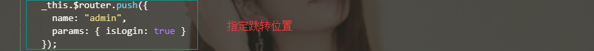
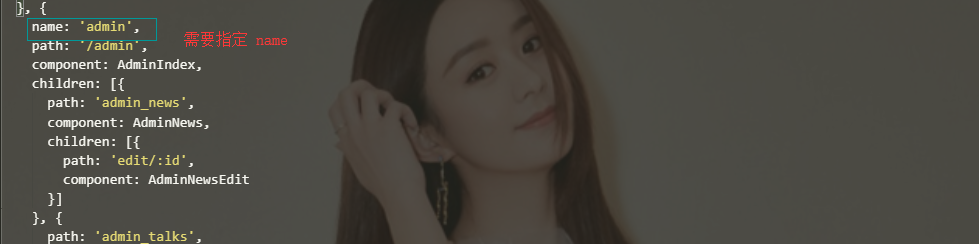

# **Vue**

**Vue 概念** 

- Vue.js 是目前 **最火** 的一个 **前端框架**. (可以用于手机App开发, 借助于Weex)
- Vue.js 是一套构建用户界面的框架 **关注视图层**, 易于上手, 便于与第三方库或既有项目进行整合 (Vue 有配套的第三方库, 可以整合起来作大型项目开发)

**学习流行框架目的**

- **提高开发效率** (原生 --- Jquery库 --- 前端模板引擎 --- **Vue.js**/React.js/Angular.js)	
- 在 Vue 中, 一个**核心**的概念, 就是让用户**不再操作 DOM 元素**, 让我们可以更多时间去关注**业务逻辑**的处理.

**框架** 是一套**完整的解决方案**; 对项目的侵入性较大.

​	库(插件) 提供单一功能, 对项目侵入性小, 可以容易切换其它库实现需求(如 从Jquery 切换到 Zepto)


**Node(后端)中的 MVC**, 是后端分层开发 (**Model** -- **View** -- **Controller**)


**前端的 MVVM 分层**

		


## 你必须成为一名合格的前端程序员, 小白要加油!

------

## vue 基础操作

**vue的基本代码 和 MVVM 的分层关系** 


### **基础**

#### 数据绑定 `{{}}`

- **`v-cloak`** 
-  **`{{}}`**  插值绑定
-  **`v-text`  **
- **`v-html`**

**`v-cloak`** 请求过程中隐藏, 解决 **`插值表达式`**  闪烁问题 (成功显示数据) 

```html
<style>
    [v-clock]: {
        display: none;
    }
</style>	
<p v-cloak>{{msg}}</p>
```

**`v-text`** 和 插值表达式 作用一般, 显示传递的数据.(默认 v-test 是没有闪烁问题的, 请求数据成功才会显示)

```html
<p v-text="msg"></p>
```

`插值表达式` 和 `v-text` **区别** `v-text` 会覆盖元素中原本的内容, 但是 `插值表达式` 只替换自己的整个占位符, 不会把整个元素的内容清空.

**`v-html`** 可以解析数据中的标签. 

#### 属性绑定 `v-bind`

- **`v-bind`** 指令 是 vue 提供的一个**绑定属性**的指令

```html
<!-- v-bind: 中, 可以写合法的 JS 表达式 -->
<input type="button" value="按钮" v-bind:title="msg + '123'"> 
<!-- 简写 -->
<input :title="msg + '123'">
```

简写方式 `:` 等同于 `v-bind:`

#### 事件绑定 `v-on`

- **`v-on`**  指令 是 vue 提供的一个**绑定事件**的指令
- 事件修饰符

```html
<div id="app">
    <input type="button" value="按钮" v-on:click="myFunc">
    <!-- 简写 @click="myFunc" -->
</div>
<script>
    var vm = new Vue({
        el: '#app',
        data: {},
        methods: { //	methods 对象中 定义了 当前 vue 实例所以可用的方法 
            myFunc(event) {
                alert('v-on 绑定事件的指令.');
                if (event) alert(event.target.tagName);
            }
        }
    })
    
   	//	也可以使用 Javascript 直接调用
    vm.myFunc();
</script>
```

简写 `@click` 等同于 `v-on:click`  其它事件绑定方式也是如此写法.

**跑马灯小案例**  <u>要获取实例上的 data 中的数据 或者 methods 中的方法, 使用 this.xx  **this 指向 实例化的VM对象.**</u>

##### **事件的修饰符**

使用的时候要注意修饰符的先后顺序， 尤其是self的使用

- **`stop` **
- **`prevent` **
- **`once` **
- **`capture`**
- **`self`**  

```html
<!-- stop 阻止冒泡-->
<div @click.stop="myFunc"></div>
<!-- prevent 阻止默认事件-->
<div @click.prevent="myFunc"></div>
<!-- capture 添加事件侦听器时使用事件捕获模式 -->
<div @click.capture="myFunc"></div>
<!-- self 只当事件在该元素本身(比如不是子元素) 触发时触发函数 -->
<div @click.self="myFunc"></div>
<!-- once 事件只触发一次-->
<div @click.once="myFunc"></div>
<!-- 事件修饰符可以一次性多个修饰 -->
<div @click.once.prevent="myFunc"></div>
```

.self 和 .stop 的区别就在于 self 只阻止对自己冒泡的行为, 不负责对别人冒泡行为影响.

在2.3.0版本，Vue 新增修饰符 **.passive**, 它会告诉浏览器我不想阻止滚动事件。

##### 按键修饰符

在监听键盘事件时，我们经常需要检查常见的键值。Vue 允许为 `v-on` 在监听键盘事件时添加按键修饰符

```html
<!-- 只有在 `keyCode` 是 13 时调用 `vm.submit()` -->
<input @keyup.13="submit">
<!-- 记住所有的 keyCode 比较困难，所以 Vue 为最常用的按键提供了别名 -->
<input @keyup.enter="submit">
```

可以通过全局 `config.keyCodes` 对象自定义按键修饰符别名

```js
// 可以使用 `v-on:keyup.f1`
Vue.config.keyCodes.f1 = 112
```

##### 系统修饰符

可以用如下修饰符来实现仅在按下相应按键时才触发鼠标或键盘事件的监听器。

- `.ctrl`
- `.alt`
- `.shift`
- `.meta`

```html
<!-- 只有在ctrl键和鼠标点击同时进行才会触发dosomething函数 -->
<div @click.ctrl="doSomething">Do something</div>
```

2.5.0 新增 `.exact` 修饰符，精确指定系统修饰符

```
<!-- 有且只有 Ctrl 被按下的时候才触发 -->
<button @click.ctrl.exact="onCtrlClick">A</button>

<!-- 没有任何系统修饰符被按下的时候才触发 -->
<button @click.exact="onClick">A</button>
```

#####　鼠标按键修饰符

> 2.2.0 新增

- `.left`
- `.right`
- `.middle`

```html
<!-- 仅当鼠标右键和 ctrl 组合才可以触发 -->
<button @click.right.ctrl.exact="onCtrlClick">B</button>
```


#### 双向数据绑定 `v-model`

**`v-model` **指令 表单元素实现双向数据绑定

```html
<!-- v-bind 只能实现数据的单向绑定 从 Model 自动绑定到 View -->
<input v-bind:value="msg">
<!-- v-model 可以实现数据双向绑定 M 和 V 的双向绑定. 注意: 只能运用在表单元素中 -->
<input v-model="msg">
```

注意： 在文本区域插值 (`<textarea></textarea>`) 并不会生效，应用 `v-model` 来代替。

我们在使用 v-model 对表单元素进行数据绑定的时候， 如果取多个值如复选框，多选情况绑定数据一般是一个 `[]`, 如果是单值情况， 一般是一个字符串 `''`。 如我们绑定复选框


vue提供了一个修饰符 **.lazy** 只有在表单更新的时候才进行数据绑定 

```html
<!-- 在“change”时而非“input”时更新 -->
<input v-model.lazy="msg" >
```

vue提供了一个修饰符 **.number** 自动把用户输入的值转为数值

```html
<input v-model.number="age" type="number">
```

vue提供了一个修饰符 **.trim** 自动去除输入值的首尾空格

 ```html
<input v-model.trim="msg">
 ```


#### 使用样式 `:class`

```html
<style>
    .nomalC{
        color: deeppink;
    }
    .nomalB{
        background: #fff;
    }
    .active{
    	color: #fff;
        background: deeppink
    }
</style>	
<body>
    <div id="app">
        <!-- 第一种使用方式, 使用v-bind绑定, 直接传递数组, 传递类名即可 -->
        <h2 :class="['nomalC', 'nomalB']">默认文字</h2>
        <!-- 在数组中编写三元表达式, 选择类 -->
        <h2 :class="['nomalC', '', flog?'active:'']">默认文字</h2>
    	<!-- 在数组中编写成对象方式代替三元, 选择类 -->
        <h2 :class="['nomalC', 'nomalB', {'active': flag}]">默认文字</h2>
    	<!-- 直接使用对象的方式, 选择类 对象属性是类名(可不带引号), 值是一个标识符-->
        <h2 :class="{nomalC: true, nomalB: true, active: flag}">默认文字</h2>
        <h2 :class="classObj">默认文字</h2>
    </div>
    <script>
        new Vue({
            el: '#app',
            data: {
                flog: flase,
                classObj: {nomalC: true, nomalB: true, active: flag},
            }
        })
    </script>
</body>
```

#### 使用样式 `:style`

```html
<body>
    <div id="app">
        <!-- 直接通过 v-bind 给对象绑定样式. 对象就是无序键值对的集合 -->
        <h2 :style="{color: 'deeppink', background: '#fff', 'font-size': 200}">默认文字</h2>
        <h2 :style="styleObj">默认文字</h2>
    	<!-- 绑定多个样式 使用数组-->
        <h2 :class="[styleObj, styleObj2]">默认文字</h2>
    </div>
    <script>
        new Vue({
            el: '#app',
            data: {
                flog: flase,
                styleObj: {color: 'deeppink', background: '#fff', 'font-size': '24px'},
                styleObj2: {'font-weight': 200, 'padding: 10px'},
            }
        })
    </script>
</body>
```

#### 列表渲染 **`v-for`**

**遍历数组**

```html
<!-- 遍历普通数组 -->
<p v-for="item in list">{{item}}</p>
<p v-for="(item, i) in list">索引: {{i}} ---项: {{item}}</p>
<!-- 循环对象数组 -->
<p v-for="item in list">{{item.id}}---{{item.name}}</p>
<p v-for="(item, i) in list">{{item.id}}---{{item.name}}---{{i}}</p>
```

**遍历对象**

```html
＃　user: {id:1, name: '小白', gender: 1}
<!-- 遍历对象 遍历对象时键值对位置是相反的-->
<li v-for="(val, key) in user">{{val}}---{{key}}</li>
<!-- ()中第三个参数是对象的索引 -->
<li v-for="(val, key, index) in user">{{val}}---{{key}}---{{index}}</li>
```

**迭代数字**

```html
<!-- 使用 v-for 迭代数字, 从 1 开始 -->
<p v-for="count in 10">这是第 {{count}} 次循环</p>
```

**使用注意事项**

>  2.20 +  版本中, 在**组件中使用** v-for 时候, **key**的值是必须的.(唯一身份). 一般我们会将数据的唯一标识作为 key 的值

```html
<!-- 组件中使用 v-for 循环, 或者特殊情况中, 必须使用同时, 指定唯一标识 :key 值 -->
<!-- v-for 循环的时候 key 属性需要使用 v-bind 绑定 并且只能使用 number 或者 string -->
<li v-for="item in list" :key="item.id">{{item.id}}---{{item.name}}</li>
```

##### **数组更新检测（视图跟随变化）**

在 vue 中, 我们通过下标实现对数组进行添加／修改等操作, 数据发送变化, 但是页面不会直接跟随响应. 


1. 通过七个**变异方法**实现页面的跟随响应 **push pop shift unshift splice sort reverse** ，使用后会改变原始数组
2. 我们还有一种方法, **直接改变数据引用地址，在使用非变异方法（如filter，concat）时，直接给数组重新赋值。**

```js
example1.items = example1.items.filter(function (item) {
  return item.message.match(/Foo/)
})
```

**注意： vue 不能检测以下数组变化情况**

1. 当你利用索引直接设置一个项时，例如：`vm.items[indexOfItem] = newValue`
2. 当你修改数组的长度时，例如：`vm.items.length = newLength`

所以我们可以使用以下两种方式解决第一种情况, 并且页面重新渲染

使用 **set** 来给某一列表数据进行修改操作并触发视图的更新

```JS
Vue.set(wm.items,"indexOfItem", "newValue");	//	全局
vm.$set(vm.items,"indexOfItem", "newValue");	//	局部
```

使用 splice 方法

```js
// Array.prototype.splice
vm.items.splice(indexOfItem, 1, newValue)
```

为解决第二种情况， 我们只能使用 splice 来修改数组的长度

```
vm.items.splice(newLength)
```

##### 对象更新检测注意

对于已经创建的实例，Vue 不能动态添加根级别的响应式属性。


但是，可以使用 `Vue.set(object, key, value)` 方法向嵌套对象添加响应式属性。

```JS
Vue.set(vm.userProfile, 'age', 27)
vm.$set(vm.userProfile, 'age', 27)
```


有时候我们需要给已有对象赋值多个值，我们可以这么做

```js
//	我们可以使用对象的 assign方法合并对象并赋值给原数据
vm.userProfile = Object.assign({}, vm.userProfile, {
  age: 27,
  favoriteColor: 'Vue Green'
})
```


##### v-if 和 v-for

注意 v-for 优先级比 v-if 高， 所以不推荐使用 v-if 判定某个数据是否遍历。 这意味着 `v-if` 将分别重复运行于每个 `v-for` 循环中。 

当我们需要循环某一些节点的时候， 可以配合使用. 以下代码值传递了 有hasVal属性的 item

```html
<li v-for='item in items' v-if='item.hasVal'> {{ item }} </li>
```

当我们在判断某个数据存在时才进行遍历可以如下使用

```html
<ul v-if='items.length'>
    <li v-for='item in items'>{{ item.xxx }}</li>
</ul>
```


##### **常用遍历的方法**

- arr.forEach(callback[, thisArg]) 一条道走到黑, 每一项执行一次 `callback` 不能停止遍历


- arr.some(callback[, thisArg])

`some` 为数组中的每一个元素执行一次 `callback` 函数，直到找到一个使得 callback 返回一个“真值”（即可转换为布尔值 true 的值）。如果找到了这样一个值，`some` 将会立即返回 `true`。

```javascript
del(delId) {	//  使用 some()遍历数组
    let Index = null;
    this.list.some((item, index) => {
        if (item.id == delId) {
            Index = index
            return true;    //  return true 手动可以停止继续遍历
        }
    })
    this.list.splice(Index, 1)
}
```

- arr.findIndex(callback[, thisArg])

`findIndex` 方法对数组中的每个数组索引 `0~length-1`（包括）执行一次 `callback` 函数，直到找到一个 `callback ` 函数返回真实值（强制为`true`）的值。如果找到这样的元素，`findIndex ` 会立即返回该元素的索引。如果回调从不返回真值，或者数组的 `length` 为0，则 `findIndex` 返回-1。

```javascript
 del(delId) {
     //  使用 findeIndex()遍历数组, 返回索引
     let Index = this.list.findIndex((item) => {
         return (item.id == delId)
     })
     this.list.splice(Index, 1)
 },
```

#### 条件渲染 `v-if/show`

```html
<h3 v-if="flag">v-if控制的默认数据</h3>
<h3 v-show="flag">v-show控制的默认数据</h3>
```

区别: 

`v-if` 是每次都是重新删除或者创建dom

`v-show` 不会进行dom的删除和创建操作, 只是切换元素的 `display `样式. 

`v-if` 有较高的切换性能消耗  `v-show` 有较高的初始渲染消耗

如果元素涉及频繁切换, 最好不使用 `v-if`  使用 `v-show`

如果元素可能永远也不会被显示出来给用户看到, 则推荐使用 `v-if`  不推荐 `v-show`

**v-if 流程判断**

```html
<div v-if='show=="a"'>This is a</div>
<div v-else-if='show=="b"'>This is b</div> 
<div v-else>This is other</div>
```

注意: 流程判断中, 不能被其它标签阻断.

**在 template 上使用 v-if**

```vue
<template v-if="ok">
  <h1>Title</h1>
  <p>Paragraph 1</p>
  <p>Paragraph 2</p>
</template>
```

最终的渲染结果将不包含 `<template>` 元素。

**使用 key 管理可复用的元素**

Vue 会尽可能高效地渲染元素，通常会复用已有元素而不是从头开始渲染。所以 **key** 可以是**元素的唯一标识**，也就是说 “这两个元素是完全独立的，不要复用它们”。


#### 自定义过滤器 `Vue.filter`

Vue 可以**自定义过滤器**, 可以用作一些**常见文本的格式化**, **过滤器可以用在两个地方 `{{}}` 和 `v-bind`**

```html
<p>{{ msg | textFormat }}</p>	<!-- 使用过滤器 -->
<script>
    //	Vue.filter('过滤器名称', function(data){}) 全局过滤器
    Vue.filter('textFormat', function(data){	//	date参数是 {{}} 传递来的数据
        return data.replace(/单纯/g, '邪恶');
    })
</script>
```

**过滤器传参**

```html
<p>{{ msg | textFormat('疯狂') }}</p>	<!-- 使用过滤器 -->
<script>
    //	Vue.filter('过滤器名称', function(data){})
    Vue.filter('textFormat', function(data, param){	//	date参数是 {{}} 传递来的数据
        return data.replace(/单纯/g, param);
    })
</script>
```

**一个数据可以使用多个过滤器.**

`{{ msg | textFormat('疯狂') | formatTwo | ... }}`

**定义私有的过滤器**

```html
<script>
    new Vue({
        el: '#app',
        data: {},
        methods: {},
        filters: {	
            //	定义私有过滤器  过滤器有两个条件, 过滤器名 &  处理函数
            dateFormat: function(data ,param){
                let YY = data.getFullYear();
                let MM = data.getMonth() + 1;
                let DD = data.getDate();
                if (param) {
                    return `${YY}-${MM}-${DD}`;
                } else {
                    let hh = data.getHours();
                    let mm = data.getMinutes();
                    let ss = data.getSeconds();
                    return `${YY}-${MM}-${DD} ${hh}:${mm}:${ss}`;
                }
            })
        }
    })
</script>
```

**过滤器调用的时候遵从就近原则, 如果全局和私有过滤器重名, 优先私有**

#### 自定义按键修饰符 `config.keyCodes`

**按键修饰符** `.enter` `.tab` `.delete` `.esc` `.space` `.up` `.down` `.left` `.right`

```html
<!-- 只要触发enter键就可以触发add函数 -->
<input type="text" @click.enter="add">
<input type="text" @click.13 = "add">
```

**我们可以通过全局的 Vue.config.keyCodes 对象自定义按键修饰符(定义别名)**

```html
<input type="text" @click.f2="add">
<script>
    //	自定义全局按键修饰符(别名 f2)
    Vue.config.keyCodes.f2 = '113';
</script>
```

#### 自定义指令 `Vue.directive`

**约定在vue中自定义指令, 都用 `v-` 开头**

```html
<input type="text" v-focus>
<script>
    //	自定义全局的指令  参数一(指令名称, 定义的时候不需要加v-, 在调用的时候必须指令名称前加上 `v-` 前缀)  
    //	第二个参数 是一个对象, 这个对象身上有一些指令相关的钩子函数, 这些函数可以在特定阶段执行相关操作
    Vue.directive('focus', {
        //	当指令绑定到元素上的时候会立即执行bind函数, 只执行一次
        bind(el) {	
            //	在每个函数中, 第一个参数永远是el, 表示被绑定了指令的元素. el参数就是一个原生的DOM对象
            console.log('被绑定了自定义指令')
        },
        //	当绑定元素插入到DOM中的时候会执行inserted函数, 只触发一次
        inserted(el) {
             el.focus();
        },
        //	当绑定元素更新的时候会执行update函数, 可能会触发多次
        update(el) {},
        //....
    })
</script>	
```

**自定义指令可以传参, 通过 第二个参数对象(binding)获取**

```html
<!-- 传递字符串pink -->
<p v-color="'pink'"></p>
<script>
    Vue.directive('color', {
        //	样式只要通过指令绑定给了元素, 不管元素是否有无被插入到页面中去, 该元素是已经存在了该内联样式
        bind(el, binding) {
            el.style.color = binding.value;
        }
    })
</script>
<!--
钩子函数的参数
el:指令绑定元素
binding: 一个对象, 包含以下参数
	name: 指令名
	value: 指令的绑定值
	expression: 绑定值的字符串形式
	...
-->
```

<u>和 JS 行为有关的操作, 最好在 inserted 中执行, 和 css 相关的操作, 一般都可以在 bind 中执行</u>

**自定义私有指令**

```html
<div v-color="'green'"></div>
<script>
    new Vue({
        el: '#app',
        data: {},
        methods: {},
        filters: {},
        directives: {
            'color': {
                bind(el, binding) {
                    el.style.color = binding.value;
                }
            }
        }
    })
</script>
```

**自定义指令函数简写**

大多出情况下, 我们想在 `bind` 和 `update` 钩子函数做重复怒动作, 并且不关心其它 钩子函数, 可以如下简写

```html
<script>
    new Vue({
        el: '#app',
        data: {},
        methods: {},
        filters: {},
        directives: {
            'color': function(el, binding){	//	这个 function 等同于把代码写到了 bind 和 update 中去了.
                el.style.color = binding.value;
            }
        }
    })
</script>`
```

#### 侦听器 `watch:{}`

> 侦听器 watch 一般使用于非 dom 事件触发 的侦听及反馈

当需要在数据变化时执行异步或开销较大的操作时，这个方式是最有用的

```javascript
//	参数一: 新值  参数二: 旧值
watch: {
    //	数据变化 就会执行函数的回调
    'firstName': function (NEWVALUE, OLDVALUE) {
        console.log('新值--' + NEWVALUE, '旧值--' + OLDVALUE)
        this.fullName = this.firstName + this.lastName
    }
}
```

#### 计算属性 `computed:{}`

在 computed 中可以定义一些 属性, 这些属性, 叫做 **[计算属性]**, 本质就是一个方法. 

我们在使用 这些计算属性的时候, 是把他们的名称, 直接当做 属性来使; 并不会把计算属性, 当做方法去调用. 

只要计算属性方法内部所用到的任何 数据 发生变化, 都会重新计算 这个计算属性的值.

任何数据都没发生变化, 则不会重新对 计算属性 进行重新计算. **缓存机制**

```javascript
/* 我们在使用计算属性的时候直接将其当做普通属性使用 : {{ sum }} */
computed: {
    'sum':function() {
        return this.count * this.price
    }
}
```

> ​	模板内的表达式非常便利，但是设计它们的初衷是用于简单运算的。在模板中放入太多的逻辑会让模板过重且难以维护。所以，对于任何复杂逻辑，你都应当使用**计算属性**。

```javascript
/* 使用 如此:{{ changeMSG }} */
computed: {
    changeMSG() {
        return this.msg.substring(2)
    }
}
```

**用方法的方式也可以实现数据的重新计算** 没有缓存计算

```javascript
/* {{ changeMSG() }} */
methods: {
    changeMSG() {
        return this.msg.substring(2)
    }
}
```

**computed 缓存 VS methods**  

计算属性是基于它们的依赖进行缓存的。**计算属性只有在它的相关依赖发生改变时才会重新求值**。这就意味着只要 `message` 还没有发生改变，多次访问 `reversedMessage` 计算属性会立即返回之前的计算结果，而不必再次执行函数。

相比之下，每当触发重新渲染时，调用方法将**总会**再次执行函数。

**计算属性的 `setter`**

计算属性默认只有 getter ，不过在需要时你也可以提供一个 setter, 当我们修改该计算属性的时候执行 set 方法

```javascript
computed: {
  fullName: {
    get: function () {
      return this.firstName + ' ' + this.lastName
    },
    set: function (newValue) {
      var names = newValue.split(' ')
      this.firstName = names[0]
      this.lastName = names[names.length - 1]
    }
  }
}
```


### vue实例的生命周期

从 vue 实例创建 运行 销毁期间, 总是伴随着各种各样的事件(函数), 统称实例的生命周期. 


## vue-resource 和 axios

**vue-resource 实现 get, post, jsonp请求**

> 下载 vur-resource 库 依赖于vue
>
> ​	**npm install vue-resource**

**基本使用**

```javascript
// GET /someUrl
this.$http.get('/someUrl').then(response => {
    // get body data
    this.someData = response.body;
}, response => {
    // error callback
});
```

**vue-resource 使用**

```javascript
//	get
this.$http.get('http://vue.studyit.io/api/getlunbo').then((result) => {
    console.log(result.body); //  通过result.body拿到成功请求后的数据
}, (errResult) => {
    console.log('获取数据失败')
})
//	post
this.$http.post('http://vue.studyit.io/api/post', {	
    //	发送给后台的数据
}, {	//  配置对象 通过post 方法的第三个参数设置提交的内容的类型为普通的表单数据格式
    emulateJSON: true
}).then(function (result) {
    console.log(result);
})
//	jsonp
this.$http.jsonp('http://vue.studyit.io/api/jsonp').then(function(result){
    console.log(result)
})
```

### **axios 的使用**

**下载 axios**	**`npm install axios`**

**使用在线地址** 	**<script src="https://unpkg.com/axios/dist/axios.min.js"></script>**

> 参考文档: https://github.com/axios/axios

**基本 get 方式请求**

```javascript
//	执行get请求, 我们可以这么干
axios.get('/user?ID=12345')
    .then(function (response) {
    	// handle success
    	console.log(response);
	})
    .catch(function (error) {
    	// handle error
    console.log(error);
	})
    .then(function () {
    	// always executed
	});

//	也可以这么干
axios.get('/user', {
    params: {
      ID: 12345
    }
  })
  .then(function (response) {
    console.log(response);
  })
  .catch(function (error) {
    console.log(error);
  })
  .then(function () {
    // always executed
  });
```

**基本的post**

```javascript
//	执行POST请求
 axios.post('/user', {
     firstName: 'Fred',
     lastName: 'Flintstone'
 }, {
     'content-type': 'application/x-www-form-urlencoded'
 })
     .then(function (response) {
         console.log(response);
     })
     .catch(function (error) {
         console.log(error);
     });
```

**注意: 使用axios的 post 时, 注意与后端请求头保持一致, 否则 后端无法获取请求数据.**

**执行多个并发请求**

```javascript
//	执行多个并发请求
function getUserAccount() {
  return axios.get('/user/12345');
}

function getUserPermissions() {
  return axios.get('/user/12345/permissions');
}

axios.all([getUserAccount(), getUserPermissions()])
  .then(axios.spread(function (acct, perms) {
    // Both requests are now complete
  }));
```

#### axios post 请求传值给 php 脚本

```javascript
axios 的POST请求默认请求数据格式为 application/json
php 一般我们都是设置成 application/x-www-urlencoded
解决方法: 
	1. 保持请求和响应的头部信息一致 *
    2. 使用 axios 内置的 QS模块对上传的数据进行加工 
```


如此, 在 php 端就可以使用 $_POST 正常地接收 axios 传递的post请求数据了.

## transition 过渡&动画

> 参考地址: https://cn.vuejs.org/v2/guide/transitions.html


### 手动实现动画

```html
<style>
    /* 动画进场状态 */
    .fade-enter-active {
        transition: all .3s ease;
    }
    /* 动画出场状态 */
    .fade-leave-active {
        transition: all .8s cubic-bezier(1.0, 0.5, 0.8, 1.0);
    }
    /* 动画状态起始/结束定点状态 */
    .fade-enter {
        transform: translateX(20px);
        opacity: 0;
    }
    .fade-leave-to {
        transform: translateX(-20px);
        opacity: 0;
    }
</style>

<div id="app">
    <div>
        <button @click="show = !show">点击动画</button>
        <transition name="fade">	<!-- 指定动画名称 -->
            <p v-if="show">hello vue animate</p>
        </transition>
    </div>
</div>

<script>
    let vm = new Vue({
        el: '#app',
        data: {
            show: false
        }
    })
</script>
```

### animate.css 动画库

我们可以给类名指定其它实现动画


由此我们可以**使用 animation 库实现动画的切换**

```html
<!-- 1. 引入库 -->
<script src="./lib/vue-2.4.0.js"></script>
<link rel="stylesheet" href="./lib/animate.css">

<div id="app">
    <div>
        <button @click="show = !show">点击动画</button>
        <!-- 2.指定enter-active-calss(进入)leave-active-class(离开)动画类 (注意: 需要添加animated 基本类) -->
        <transition name="fade" enter-active-class="animated fadeInUp" leave-active-class="animated fadeOutRightBig">
            <p v-if="show">hello vue animate</p>
        </transition>
    </div>
</div>

<script>
    let vm = new Vue({
        el: '#app',
        data: {
            show: false
        }
    })
</script>
```

**`duration` 属性定制一个显性的过渡持续时间 (以毫秒计), `mode`  指定动画顺序, 推荐 out-in**

```html
<transition name="slide-fade" mode='out-in' :duration="{enter：2000，leave：3000}">	<!-- 指定动画样式持续时间 2.2 + -->
    <p v-if="show">hello vue animate</p>
</transition>
```

**animation 和 transition 共存**

```html
 <transition name='fade'
            appear
            appear-active-class="enter"
            type="animation"	<!-- 声明以animation的持续时间为整个动画持续时间 -->
            leave-active-class='leave fade-leave-active'
            enter-active-class='enter fade-enter-active'>
            <div class="box" v-show='flag'>动画切换</div>
</transition>
```


### 使用js实现动画

```html
<!-- 入场钩子函数和出场钩子函数 -->
<transition
            @before-enter="beforeEnter"
            @enter="enter"
            @after-enter="afterEnter"
            @enter-cancelled="enterCancelled"

            @before-leave="beforeLeave"
            @leave="leave"
            @after-leave="afterLeave"
            @leave-cancelled="leaveCancelled"
           >
    <div class='box'>
        盒子
    </div>
</transition>
```

```javascript
// ...
methods: {
  // --------
  // 进入中
  // --------
  beforeEnter: function (el) {
    // ...
  },
  // 此回调函数是可选项的设置 与 CSS 结合时使用
  enter: function (el, done) {
    // ...
    done();	//	done 在动画执行完毕之后调用 afterEnter 钩子
  },
  afterEnter: function (el) {
    // ...
  },
  enterCancelled: function (el) {
    // ...
  },
  // --------
  // 离开时
  // --------
  beforeLeave: function (el) {
    // ...
  },
  leave: function (el, done) {
    // ...
    done()//	done 在动画执行完毕之后调用 afterLeave 钩子
  },
  afterLeave: function (el) {
    // ...
  },
  // leaveCancelled 只用于 v-show 中
  leaveCancelled: function (el) {
    // ...
  }
}
```

**小球动画的案例**

```html
<!DOCTYPE html>
<html lang="en">
<head>
    <meta charset="UTF-8">
    <meta http-equiv="X-UA-Compatible" content="ie=edge">
    <title>动画</title>
    <script src="./lib/vue-2.4.0.js"></script>
    <style>
        .ball {
            width: 15px;
            height: 15px;
            background: deeppink;
            border-radius: 50%;
        }
    </style>
</head>
<div id="app">
    <div>
        <button @click="flag = !flag">加入购物车</button>
        <transition name="ball-animate" @before-enter="beforeEnter" @enter="enter" @after-enter="afterEnter">
            <div class="ball" v-if="flag"></div>
        </transition>
    </div>
</div>
<body>
    <script>
        let vm = new Vue({
            el: '#app',
            data: {
                flag: false
            },
            methods: {
                //  第一个参数 el 表示要执行动画动画的dom结构
                beforeEnter: function (el) {
                    //  beforeenter 表示动画入场之前, 此时动画尚未开启
                    //  可以设置动画开始之前, 小球动画的起始样式
                    el.style.transform = 'translate(0, 0)'
                },
                enter: function (el, done) {
                    //  没有实际的作用, 但是不写没有动画
                    //  可以认为 offset 相关 会强制动画刷新 *
                    el.offsetWidth
                    //  enter 表示动画 开始后中的样式.
                    el.style.transform = 'translate(150px, 450px)'
                    el.style.transition = 'all 1s ease'
                    //  当动画完成想要立即消失, 需要调用第二个参数执行
                    //  这里的 done 其实就是 afterEnter 函数的引用
                    done();
                },
                afterEnter: function (el) {
                    //  动画完成之后, 回到用 afterEnter
                    this.flag = !this.flag;
                }
            }
        })
    </script>
</body>
</html>
```

#### velocity.js

[velocity.js](http://velocityjs.org/#bugs)


### 组件动画

**元素切换动画**


**组件的切换动画**


**使用 component 来确定组件动画的执行**


### 列表过渡（transition-group）

`transition-group` 标签

- `appear` 属性， 确定动画是否先执行一次
- `tag` 属性


```html
<!DOCTYPE html>
<html lang="en">

<head>
    <meta charset="UTF-8">
    <meta name="viewport" content="width=device-width, initial-scale=1.0">
    <meta http-equiv="X-UA-Compatible" content="ie=edge">
    <title>列表动画</title>
    <script src="../node_modules/vue/dist/vue.js"></script>
    <style>

    </style>
    <style>
        .enter {
            animation: enter 2s;
        }
        @keyframes enter {
            0% {
                opacity: 0;
                transform: translateY(200px) scale(0.8);
            }

            100% {
                opacity: 1;
                transform: translateY(0px) scale(1);
            }
        }
        .leave {
            animation: leave 2s;
        }
        @keyframes leave {
            0% {
                opacity: 1;
                transform: translateX(0px) scale(1);
            }
            100% {
                opacity: 0;
                transform: translateX(100px) scale(0.8);
            }
        }
    </style>
</head>

<body>
    <div id="app">
        <input type="text" v-model='inpVal'>
        <button class="button" @click='Add'>添加内容</button>
        <transition-group tag='ul' appear appear-active-class="enter" mode='out-in' name='fade' enter-active-class='enter' leave-active-class='leave'>
            <li v-for="(item,index) in items" :key="item.id" @click='Remove(item.id)'>{{ item.name }}</li>
        </transition-group>
    </div>
    <script>
        var vm = new Vue({
            el: '#app',
            data: {
                items: [{
                        id: 1,
                        name: '小白'
                    },
                    {
                        id: 2,
                        name: '懵宝'
                    },
                    {
                        id: 3,
                        name: '萌新'
                    },
                ],
                inpVal: ''
            },
            methods: {
                Add() {
                    this.items.push({
                        id: this.items.length ? (this.items[this.items.length - 1]['id'] + 1) : 1,
                        name: this.inpVal
                    });
                    this.inpVal = '';
                },
                Remove(Index) {
                    let index = this.items.findIndex((item) => {
                        return item.id == Index
                    })
                    this.items.splice(index, 1);
                }
            }
        })
    </script>
</body>
</html>
```

### 动画的封装


## 组件和模块化

> 模块化: 是从代码逻辑的角度进行划分的, 方便代码分层开发, 保证每个功能模块职能单一.
>
> 组件化: 是从UI界面的角度机械能划分的, 前端的组件化, 方便 UI 组件的重用.

### 组件

​	组件的出现, 就是为了拆分 Vue 实例的代码量, 能够让我们以不同的组件, 来划分不同的功能模块, 将来我们需要什么样的功能, 就可以去调用对应的组件即可

#### 定义vue组件(全局)

**使用组件** `<my-com1></my-com1>`

**全局组件的定义的三种方式**

1. `Vue.extend` 配合 `Vue.component` 

```javascript
let com1 = Vue.extend({
	template: '<h3>组件1</h3>'
});
Vue.component('myCom1', com1)
```

2. 单独使用 `Vue.component`

```javascript
Vue.component('myCom1', {
    props:['content']
    template: '<h3>{{content}}</h3>
})
```

3. 配合模板引擎, 使用 `Vue.component` 更加直观 **推荐**

```html
<script id="tmpl" type="x-template">
	<h3>组件</h3>
</script>

Vue.component('myCom1', {
    template: '#tmpl'
})
```

​	<u>注意: 不论是哪一种方式创建出来的组件, 组件的 template 属性指向的模板内容, 必须由一个唯一的根元素包裹起来.</u>

#### 定义vue组件(局部)

​	全局注册往往是不够理想的。比如，如果你使用一个像 webpack 这样的构建系统，全局注册所有的组件意味着即便你已经不再使用一个组件了，它仍然会被包含在你最终的构建结果中。这造成了用户下载的 JavaScript 的无谓的增加。

```javascript
let vm = new Vue({
    el: '#app',
    data: {

    },
    components: {
        'myCom1': {
            template: '#tmp1'
        }
    }
})
```

```javascript
var ComponentA = { /* ... */ }
var ComponentB = { /* ... */ }
var ComponentC = { /* ... */ }

new Vue({
  el: '#app'
  components: {
    'component-a': ComponentA,
    'component-b': ComponentB
  }
})
```

#### 组件中的 `data` 和 `methods`

组件可以有自己的 `data` 数据, 并且 `data` 必须是一个函数, 并且必须返回一个对象. 组件中的 `data`

使用方式 和 实例中的 data 使用方式完全一样

```javascript
 Vue.component('myCom',{
    template: '#tmp1',
    data(){
        return {
            msg: 'myCom组件的一个数据'
        }
    },
    methods: {}
})
```


#### 组件通讯

- **prop对象**
- **$emit()**

**父组件传值给子组件及子组件获取值** *父组件通过属性的形式向子组件传递数据*


**注意: ** 子组件不能直接改变父组件传递来的数据(**单向数据流**)

​	所有的 prop 都使得其父子 prop 之间形成了一个**单向下行绑定**：父级 prop 的更新会向下流动到子组件中，但是反过来则不行。这样会防止从子组件意外改变父级组件的状态，从而导致你的应用的数据流向难以理解。

如果要修改值如何实现? 

1. 在本身的 data 中定义一个数据(副本), 指向父组件传递来的数据
2. 修改的时候修改本身定义的数据

3. 如果实现子组件修改数据, 父组件跟随变化呢? 需要子组件传递数据给父组件,  让父组件自己作修改

**子组件传值给父组件及父组件获取值** *子组件主动向父组件发送值, 并且父组件执行本身绑定给子组件的方法接收值*


**综合来看**


**Prop验证和非prop**


#### 非父子组件传值


#### 组件使用插槽（slot）

**具名插槽: 可以设定多个插槽**


**作用域插槽: **


#### 动态组件(component)

**使用 vue 的内置标签 component 实现组件的切换**


**v-once指令** 在使用动态组件的时候添加 v-once 指令, 可以将组件保存到缓存机制, 有效提高效率


#### 组件切换的过渡

外部套用一个动画标签, 指定 `mode `规定动画进出顺序即可

```html
<transition name="component-fade" mode="out-in">
	<component v-bind:is="view"></component>
</transition>
```


#### 在组件上绑定原生事件


#### 获取DOM元素 及 组件

`$refs['ref名称']`

```js
## dom 结构
<div ref="myDiv"></div>
## 组件 获取
<coml ref="myComl"></coml>
## 获取 dom 元素
this.$refs['myDiv']
## 获取 组件 内部的属性/方法 此时表示是该组件的引用
this.$refs['myComl']['方法/数据']
```

##### 父组件调用子组件方法

1. 子组件内部定义方法

   

2. 父组件通过 ref 绑定组件

   

3. 父组件通过调用 $refs['子组件内部方法'] 触发子组件内部方法

   

##### 子组件调用父组件方法

1. 父组件定义方法

   

2. v-on方式传递方法给子组件

   

3. 子组件内部使用 $emit 调用父组件方法

   


#### 使用 render 函数渲染组件

```html
<body>
    <div id="app"></div>
    <script>
        let LOGIN = {
            template: '<h1>这是登录组件</h1>'
        }
        let vm = new Vue({
            el: '#app',
            data: {},
            methods: {},
            render(createElement) { //  使用render函数渲染组件
                //  createElement 是一个方法 调用它能把一个组件模板渲染为 HTML 结构
                return createElement(LOGIN);
                //  注意: return 的结果会替换页面中 el 指定的那个容器
            }
        })
        //  使用render方式渲染组件会直接干掉 el 绑定的元素, 把自己放上去 *****
    </script>
</body>
```

#### 独立组件基本架构

```vue
<template>
	<div>
		<!-- ..内容 -->
    </div>	
</template>
<script>
export default {
    data() {
        //	主键中的 data 必须是一个方法, return 一个对象
        return {}
    },
    methods:{
        func(){
            console.log('调用了xxx方法')
        }
    }
}    
</script>
<!-- 设置scoped表示只限本组件使用; style 指定 lang 表示使用什么语法书写css  
	scoped属性 的实现原理
		给元素指定了自定义属性 data-v-xxxx
		即通过css的属性选择器实现的(element[data-v-c3743260])	
-->
<style scoped lang="less">	
    html, body{
        .avtive{
        	//...
        }
    }
</style>
```

#### 组件中的细节及问题

1. 使用 **is** 属性解决模板组件使用时出现的 bug

   ```html
   <div id='root'>
       <table>
           <tbody>
               <tr is="row"><tr>
               <tr is="row"><tr>
               <tr is="row"><tr>
           </tbody>
       </table>
   </div>
   <script>
       Vue.component('row',{
           template: '<tr><td>this is a row</td></tr>'
       })
   	var vm = new Vue({
       	el: '#root'
       })
   </script>
   ```


### 模块

#### export default 和 export 使用方式

- `module.exports = {} ` 是 Node 中向外暴露成员的方式
- 在ES6中, 也通过了 规范形式, 规定了 ES6 中如何 **导入和导出** 模块
- ES6 中导入模块 使用 **`import 模块名称 from '模块标识符'`, `import '路径'`**.
- 注意: ES6 中暴露成员, 使用 `export default`  和 `export` 向外暴露成员
- **注意:** `export default` 向外暴露的成员 可以 **自定义变量** 接收 
- 注意: 在一个模块中, `export default` 只允许向外暴露一次
- 注意: 在一个模块中可以同时使用 `export default`  和 `export` 同时向外暴露成员
- 注意: `export` 暴露的成员 只能使用 `{}` 形式接收(必须名称匹配, 当然可以 as xxx 改变), 这种方式叫做 **按需导出**

```javascript
# export default 只能导出一次
export default router

# export 按需导出  可以向外暴露多次
export var love = '这是什么意思?'
export var title = '星儿'

# 接收 export default 暴露的成员
import xxx from 'xxx'  
import from 'xxx'

# 需要时导入 只能使用 {} 接收, 不需要的可以不在 {} 中导入需要模块
import { title, love } from 'xxx'
# 使用 export 导出的成员, 如果想换个名称接收, 可以使用 as 取别名 如 sql 操作的别名
import { title, love as what } from 'xxx'
```


#### 路由模块的抽离

```javascript
/* 抽离 路由模块 */
import Vue from 'vue'
import VueRouter from 'vue-router'
Vue.use(VueRouter)
//	vue组件的引入
import account from "./main/Account.vue"
import goodslist from "./main/GoodsList.vue"
import register from "./main/Register.vue"
import login from "./main/login.vue"
//	路由配置
var router = new VueRouter({
    routes: [{
        path: '/account',
        component: account,
        children: [{
                path: 'register',
                component: register
            },
            {
                path: 'login',
                component: login
            }
        ]
    }, {
        path: '/goodslist',
        component: goodslist
    }]
})
//	导出路由
export default  router;
```


## vue-router 路由

**后端路由**: 对于普通的网站, 所有的额超链接都是 URL 地址, 所有 URL 地址都对对应服务器上对应的资源

**前端路由**: 对于单页面程序来说, 主要通过 URL 中的 hash(#) 来实现不同页面之间的切换, 同时 hash 有一个特点: HTTP 请求中不会包含 hash 相关 的内容; 所以, 单页面程序中的页面跳转朱啊哟用 hash 实现

**单页面程序中, 这种通过 hash 改变来切换页面的方式, 称作前端路由**

### 路由基础

- `<router-link to="/target" tag="span"></router-link>` 路由标签 及 `tag` 渲染标签 `to ` 指定路由
- ` <router-view></router-view>` 命名视图
- ` { path: '/', redirect: '/login' }` 重定向也是通过 `routes` 配置来完成(路由默认的激活)
- `mode: 'history'` 指定路由的 **history 模式** hash 表现的修改
- `linkActiveClass: 'avtive'` 可以通过路由的构造选项 `linkActiveClass` 来全局配置默认激活类名

```html
<!DOCTYPE html>
<html lang="en">
<head>
    <meta charset="UTF-8">
    <meta name="viewport" content="width=device-width, initial-scale=1.0">
    <meta http-equiv="X-UA-Compatible" content="ie=edge">
    <title>vue-router</title>
    <script src="./lib/vue-2.4.0.js"></script>
    <script src="./lib/vue-router-3.0.1.js"></script>
    <style>
        .router-link-active {	/* 指定选中路由高亮的样式* */
            color: #ff4400;
        }
        .v-enter,
        .v-leave-to {
            opacity: 0;
            transform: translateX(140px)
        }
        .v-enter-active,
        .v-leave-active {
            transition: all 0.3s linear;
        }
    </style>
</head>
<body>
    <div id="app">
            <h1>路由的基本使用</h1><hr>
            <p>
              <!-- 使用 router-link 组件来导航. 默认会被渲染成一个 `<a>` 标签 -->
              <!-- tag 指定渲染什么标签 *-->
              <router-link to="/login" tag="span">登录</router-link>
              <router-link to="/register">注册</router-link>
            </p>
            <!-- 路由出口 -->
            <!-- 路由匹配到的组件将渲染在这里 指定动画-->
            <transition mode="out-in">
                <router-view></router-view>
            </transition>
    </div>
    <script id="loginTemplate" type="template">
        <h1>这里是路由组件: 登录</h1>
    </script>
    <script id="registerTemplate" type="template">
        <h1>这里是路由组件: 注册</h1>
    </script>
    <script>
        //   1. 定义 (路由) 组件。
        const Login = {
            template: '#loginTemplate'
        }
        const Register = {
            template: '#registerTemplate'
        }
        //  2. 定义路由 每个路由应该映射一个组件
        const routes = [{
                path: '/login',
                component: Login
            },
            {
                path: '/register',
                component: Register
            },
            {   //  redirect 客户端指定默认根路径展示路由	*
                path: '/',
                redirect: '/login'
            }
        ]
        // 3. 创建 router 实例，然后传 `routes` 配置
        const routerObj = new VueRouter({
            routes: routes,
            linkActiveClass: 'avtive',
            mode: 'history',
        })
        let vm = new Vue({
            el: '#app',
            data: {},
            methods: {},
            // 4. 创建和挂载根实例
            router: routerObj
        })
    </script>
</body>
</html>
```

通过注入路由器，我们可以在任何组件内通过 `this.$router` 访问路由器，也可以通过 `this.$route` 访问当前路由

```javascript
//	更改路由访问地址为根目录 
this.$router.push('/')
//	更改路由返回上一级(后退)
this.$router.go(-1)
```


#### 路由传递参数

第一种: 使用 $.route.query 接收 序列化 参数

```html
<router-link to="/login?id=10&name='小白'">登录</router-link>

## 通过 组件.query 获取传参的数据
const Login = {
    template: '#loginTemplate',
    data() {
        return {
            msg: null
        }
    },
    created() {
        console.log(this.$route);
        this.msg = this.$route.query
    }
}
```

第二种: $.route.params 匹配规则

```html
<router-link to="/register/10/小白">注册</router-link>

## 模板渲染预留位置
{
	path: '/register/:id/:name',
	component: Register
}

## 通过 this.$route.params 获取传参的数据
const register = {
    template: '#loginTemplate',
    data() {
        return {
            msg: null
        }
    },
    created() {
        console.log(this.$route);
	    this.msg = this.$route.params
    }
}
```

#### 路由嵌套

```html
<!DOCTYPE html>
<html lang="en">

<head>
    <meta charset="UTF-8">
    <meta name="viewport" content="width=device-width, initial-scale=1.0">
    <meta http-equiv="X-UA-Compatible" content="ie=edge">
    <title>vue-router</title>
    <script src="./lib/vue-2.4.0.js"></script>
    <script src="./lib/vue-router-3.0.1.js"></script>
    <style>
        .active {
            /* 指定选中路由高亮的样式* */
            color: #ff4400;
        }

        .v-enter,
        .v-leave-to {
            opacity: 0;
            transform: translateX(140px)
        }

        .v-enter-active,
        .v-leave-active {
            transition: all 0.3s linear;
        }
    </style>
</head>

<body>
    <div id="app">
        <h1>user组件</h1>
        <hr>
        <p>
            <router-link to="/user">进入user组件</router-link>
        </p>
        <transition mode="out-in">
            <router-view></router-view>
        </transition>
    </div>
    <script id="userTemplate" type="template">
        <div class="container">
            <h3>这里是user路由组件内部</h3>
            <router-link to="/user/login">登录</router-link>
            <router-link to="/user/register">注册</router-link>
            <transition mode="out-in">
                <router-view></router-view>
            </transition>
        </div>
    </script>
    <script id="loginTemplate" type="template">
        <h1>这里是路由组件: 登录</h1>
    </script>
    <script id="registerTemplate" type="template">
        <h1>这里是路由组件: 注册</h1>
    </script>
    <script>
        const User = {
            template: '#userTemplate',
        }
        const Login = {
            template: '#loginTemplate'
        }
        const Register = {
            template: '#registerTemplate'
        }
        const router = new VueRouter({
            routes: [{
                path: '/user',
                component: User,
                children: [{
                        path: 'login',
                        component: Login
                    },
                    {
                        path: 'register',
                        component: Register
                    }
                ]
            }],
            linkActiveClass: 'active'
        })
        let vm = new Vue({
            el: '#app',
            router
        })
    </script>
</body>
</html>
```

#### 编程式导航

除了使用 `<router-link>` 创建 a 标签来定义导航链接，我们还可以借助 router 的实例方法，通过编写代码来实现。

**注意**：在 Vue 实例内部，你可以通过 $router 访问路由实例。`router.push(location, onComplete?, onAbort?)`

|          声明式           |       编程式       |
| :-----------------------: | :----------------: |
| `<router-link :to="...">` | `router.push(...)` |

该方法的参数可以是一个字符串路径，或者一个描述地址的对象。例如：

```javascript
// 字符串
router.push('home')

// 对象
router.push({ path: 'home' })

// 命名的路由
router.push({ name: 'user', params: { userId: 123 }})

// 带查询参数，变成 /register?plan=private
router.push({ path: 'register', query: { plan: 'private' }})
```

**注意：如果提供了 path，params 会被忽略，上述例子中的 query 并不属于这种情况。取而代之的是下面例子的做法，你需要提供路由的 name 或手写完整的带有参数的 path：**

```javascript
const userId = 123
router.push({ name: 'user', params: { userId }}) // -> /user/123
router.push({ path: `/user/${userId}` }) // -> /user/123
// 这里的 params 不生效
router.push({ path: '/user', params: { userId }}) // -> /user
```

同样的规则也适用于 `router-link` 组件的 `to` 属性。


#### 命名视图实现经典布局

```html
<!DOCTYPE html>
<html lang="en">
<head>
    <meta charset="UTF-8">
    <meta name="viewport" content="width=device-width, initial-scale=1.0">
    <meta http-equiv="X-UA-Compatible" content="ie=edge">
    <title>Document</title>
    <script src="./lib/vue-2.4.0.js"></script>
    <script src="./lib/vue-router-3.0.1.js"></script>
    <style>
        * {
            margin: 0;
            padding: 0
        }
        .header {
            width: 100%;
            height: 60px;
            background: orange;
        }
        .container {
            display: flex;
            height: 390px;
        }
        .left {
            flex: 2;
            background: limegreen
        }
        .right {
            background: lightcoral;
            flex: 8;
        }
    </style>
</head>
<body>
    <div id="app">
        <router-view></router-view>
        <div class="container">
            <router-view name="left"></router-view>
            <router-view name="main"></router-view>
        </div>
    </div>
    <script>
        const Header = {
            template: '<h1 class="header">头部栏目</h1>'
        }
        const LeftBar = {
            template: '<h1 class="left">左边栏目</h1>'
        }
        const RightBar = {
            template: '<h1 class="right">右侧栏目</h1>'
        }
        var router = new VueRouter({
            routes: [{
                path: '/',
                components: {
                    'default': Header,
                    'left': LeftBar,
                    'main': RightBar
                }
            }]
        })
        let vm = new Vue({
            el: '#app',
            data: {},
            methods: {},
            router: router
        })
    </script>
</body>
</html>
```

### 导航守卫

**“导航”表示路由正在发生改变。**

**参数或查询的改变并不会触发进入/离开的导航守卫**。你可以通过[观察 `$route` 对象来应对这些变化，或使用 `beforeRouteUpdate` 的组件内守卫

#### 全局守卫

使用 `router.beforeEach` 注册一个全局前置守卫:

```js
const router = new VueRouter({})
router.beforeEach((to, from, next) => {})
```

当一个导航触发时，全局前置守卫按照创建顺序调用。守卫是异步解析执行，此时导航在所有守卫 resolve 完之前一直处于 **等待中**。

- **to: Route**: 即将要进入的目标 [路由对象]
- **from: Route**: 当前导航正要离开的路由
- **next: Function**: 一定要调用该方法来 **resolve** 这个钩子。
  - **next()**: 进行管道中的下一个钩子。
  - **next(false)**: 中断当前的导航.
  - **next('/') 或者 next({ path: '/' })**: 跳转到一个不同的地址。
  - **确保要调用 next 方法，否则钩子就不会被 resolved。**

#### 全局解析守卫

​	在 2.5.0+ 你可以 用 `router.beforeResolve` 注册一个全局守卫。这和 `router.beforeEach` 类似，区别是在导航被确认之前，**同时在所有组件内守卫和异步路由组件被解析之后**，解析守卫就被调用。

#### 路由独享的守卫

你可以在路由配置上直接定义 `beforeEnter` 守卫：

```js
const router = new VueRouter({
  routes: [
    {
      path: '/foo',
      component: Foo,
      beforeEnter: (to, from, next) => {
        // ...
      }
    }
  ]
})
```

这些守卫与全局前置守卫的方法参数是一样的.

#### 组件内的守卫

- beforeRouterEnter
- beforeRouterUpdate (2.2+)
- beforeRouteLeave

```javascript
const Foo = {
    template: `...`,//	组件模板
    beforeRouteEnter(to, from, next){
        //	在渲染该组件的对应路由被 confirm 前调用
        //	不能获取组件实例 this
        //	守卫执行前, 组件实例还未被创建
        //	我们可以通过传递一个 回调 给 next 访问组件实例,在导航被确认的时候执行回调
        #	注意: beforeRouteEnter 是支持给 next 触动你回调的 唯一守卫 
        next(vm=>{
           	//	通过 vm 访问组件的实例
        })
    },
    beforeRouteUpdate(to, from, next){
        //	当前路由改变, 但是组件被复用时调用
        //	举例, 对于一个电邮动态数组的路径 /foo/:id, 在 foo/1 和foo/2 之间跳转的是偶
        //	由于会渲染同样的  Foo 组件, 因此组件实例会被的服复用,而这个钩子就会在这个情况下被调用
        //	可以访问组件实例的 this
        this.name = to.params.name
        next()
    },
    beforeRouteLeave(to, from, next){
    	//	导航离开该组件的对应路由时调用
        //	可以访问 组件实例 this
        #	注意: 离开守卫通常用来 禁止用户还未保存修改前突然离开./ 该导航可以通过 next(false)取消
    	const answer = window.confirm('Do you really want to leave? you have unsaved changes!')
        if (answer) {
            next()
        } else {
            next(false)
        }
    }
}
```

**独立守卫 `beforeRouterEnter` 小练习: 验证是否登录, 从登陆页面来则进入next(), 否则自动跳至登录页**

```js
//	adminIndex 页面
beforeRouteEnter(to, from, next) {
    // 后台管理系统的守卫: 未登录 自动跳转登录页
    if (to.params.isLogin !== true) {
        next("/");
        return;
    }
    next();
}
```





#### **完整的导航解析流程**

1. 导航被处罚
2. 在失活的组件里调用离开守卫
3. 调用全局的 `beforeEach` 守卫
4. 在重用组件里 调用 `beforeRouteUpdate` 守卫
5. 在路由配置里调用 `beforeEnter`
6. 解析一步路由组件
7. 在被激活的组件里调用 `beforeRouteEnter`
8. 调用全局的 `beforeResolve`
9. 导航被确认
10. 调用全局的 `afterEach` 钩子
11. 触发dom更新
12. 用创建好的实例调用 `beforeRouteEnter` 守卫中 传给的 next 回调

### 路由元信息

定义路由的时候可以配置 `meta` 字段

```javascript
const router = new VueRouter({
    routes:[
        {
            path:'/foo',
            component:Foo,
            children:[{
                path:'bar',
                component: Bar,
                //	元信息
                meta: {
                    requireAuth: true
                }
            }]
        }
    ]
})
```

一个路由匹配到的所有路由记录会暴露为 `$route` 对象 (还有在导航守卫中的路由对象) 的 `$route.matched` 数组。

### 过渡动效

`<router-view>` 是基本的动态组件，所以我们可以用 `<transition>` 组件给它添加一些过渡效果

```html
<transition>
  <router-view></router-view>
</transition>
```

#### 单个路由的过渡

如果想让每个路由组件有各自的过渡效果，可以在各路由组件内使用 `<transition>` 并设置不同的 name。

```javascript
const Foo = {
  template: `
    <transition name="slide">
      <div class="foo">...</div>
    </transition>
  `
}

const Bar = {
  template: `
    <transition name="fade">
      <div class="bar">...</div>
    </transition>
  `
}
```

#### 基于路由的动态过渡

还可以基于当前路由与目标路由的变化关系，动态设置过渡效果：

```html
<!-- 使用动态的 transition name -->
<transition :name="transitionName">
  <router-view></router-view>
</transition>
```

```javascript
// 接着在父组件内
// watch $route 决定使用哪种过渡
watch: {
  '$route' (to, from) {
    const toDepth = to.path.split('/').length
    const fromDepth = from.path.split('/').length
    this.transitionName = toDepth < fromDepth ? 'slide-right' : 'slide-left'
  }
}
```

### 滚动行为

使用前端路由，当切换到新路由时，想要页面滚到顶部，或者是保持原先的滚动位置，就像重新加载页面那样。 `vue-router` 能做到，而且更好，它让你可以自定义路由切换时页面如何滚动。

**注意: 这个功能只在支持 history.pushState 的浏览器中可用。**

当创建一个 Router 实例，你可以提供一个 `scrollBehavior` 方法：

```javascript
const router = new VueRouter({
  routes: [
      //...
  ],
  scrollBehavior (to, from, savedPosition) {
      return { x: 0, y: 0 }
  }
})
```

### 组件 (路由缓存) 优化

[keep-alive](https://cn.vuejs.org/v2/api/#keep-alive)

**Props**：

- `include` - 字符串或正则表达式。只有匹配的组件会被缓存。
- `exclude` - 字符串或正则表达式。任何匹配的组件都不会被缓存。

**用法:**

`<keep-alive>` 包裹动态组件时，会缓存不活动的组件实例，而不是销毁它们。

当组件在 `<keep-alive>` 内被切换，它的 `activated` 和 `deactivated` 这两个生命周期钩子函数将会被对应执行。

**主要用于保留组件状态或避免重新渲染。**

> 2.1.0 新增 

`include` 和 `exclude` 属性允许组件有条件地缓存。二者都可以用逗号分隔字符串、正则表达式或一个数组来表示：

```html
<!-- 逗号分隔字符串 -->
<keep-alive include="a,b">
  <component :is="view"></component>
</keep-alive>

<!-- 正则表达式 (使用 `v-bind`) -->
<keep-alive :include="/a|b/">
  <component :is="view"></component>
</keep-alive>

<!-- 数组 (使用 `v-bind`) -->
<keep-alive :include="['a', 'b']">
  <component :is="view"></component>
</keep-alive>
```

匹配首先检查组件自身的 `name` 选项，如果 `name` 选项不可用，则匹配它的局部注册名称 (父组件 `components` 选项的键值)。匿名组件不能被匹配。

#### 路由变化参数页面组件不更新问题

**情况描述**:  很多时候, 我们仅仅是在同一个路由下(根据不同参数值, 如id)进行切换, 但是操作后会发现页面组件并未更新.

**解决方案**:

1. 使用 `watch` 侦听器对 `$route`  进行侦听

 

2. 在使用 keep-alive 时候, 构造函数中会多一个 activated 生命钩子函数，当前页面进入的时候触发, 这个时候我们就可以在 activated 钩子中判断当前页面接收的参数和上次传递的参数是否一次, 如果不一致 重新发送 ajax 请求


3. 给 keep-alive 添加 **exclude** 属性, 指定不需要缓存组件名即可. **include** 属性指定需要缓存的组件名


---

## vuex 数据管理工具

> vuex :  Vue配套的**公共数据管理工具**, 它可以把一些**共享的数据保存到 vuex, 方便整个 vue 调用或者修改 数据**


**基础使用步骤**

1. 装包 运行 `cnpm i vuex -S`
2. 导入包 
3. 注册 vuex
4. 创建数据仓储对象
5. 挂载 vuex 数据仓储对象

```javascript
//  主文件 vuex 配置
import Vue from "vue"
import Vuex from "vuex"
//	注册 vuex
Vue.use(Vuex)
//	创建数据仓库对象
let store = new Vuex.Store({
    state: {	
        // state相当于data,存储数据的对象
        // 我们可以通过 this.$store.state.count 在组件中, 访问这个count
        count: 0
    },
    mutations: {
        //	操作state仓库中的数据, 推荐通过该 mutations 提供的方法进行数据的操作
        // 	参数一是 state仓库数据对象, 参数二是我们在组建中调用该方法时传递的第二个参数
        //	在组件中调用 mutations 中的方法: this.$store.commit('increment', [2, 2])
        increment(state) {
            state.count++
        },
        decrement(state, params) {
            state.count -= (params[0] + params[1])
        }
    },
    getters: {
        //	对外提供数据作了一层包装
        optCount(state) {	//	类似 computed 的一个数据包装容器
    		return "当前最新的count值是:" + state.count
		}
    }                       
})
new Vue({
    el: '#app',
    render: c=>c(App),
    //	挂载vuex, 当 vuex仓库 挂载到 vue实例上的时候, 才可以在组件中通过 this.$store 操作管理数据仓库中的数据
    store,
})
```

```js
// 子组件调用 store 仓库工具的 方法修改数据
this.$store.commit('increment')
this.$store.commit('decrement', [2, 3])
// 子组件使用 store 仓库中的 数据 (通过getters修饰后的)
{{$store.getters.optCount}}
```

**小结:** 

1. **`state` 中的数据, 不能直接修改, 如果想要修改, 必须通过 `mutations` 中的方法进行托管操作**
2. 如果组件想要**从 `state` 上获取数据, 需要 `this.$store.xxxx` 获取**所需的
3. 如果组件, 想要修改数据, 必须通过 `mutations` 提供的方法, 需要**通过 `this.$store.commit('mutations提供的方法名', '唯一参数')` 进行数据的修改**
4. 如果 `store` 中 `state` 上的数据 在对外提供的时候, 需要作一层包装, 那么**推荐使用 `getters` 对象进行数据的包装(和过滤器相似, 需要return). 外部调用包装后的数据方式是: `this.$store.getters.xxx**`

### vuex 中几个处理模块

**mapState 模块的使用**


**mapMutations 模块的使用**


如果传递的是一个对象, 用法与 mapState 如出一辙

### vuex 中的 Module

为了 vuex 管理更多复杂的共享数据

[vuex的模块](https://vuex.vuejs.org/zh/guide/modules.html)


## vue-cli 脚手架工具

安装

```
npm install -g vue-cli
```

启动

```
vue init webpack myProject
-----------------
Project name xxx
Project description xxxx
Author xxx
Use ESlint to lint your code? y
Setup unit tests with Karma + Mocha? n
Set e2e tests with Nightwatch? n
```

项目文件介绍

```
- build 			webpack 配置相关
- config			webpack 配置相关
- src 	 			存放代码源码文件
- static   			存放静态资源文件
- .babelrc 			babel编译配置 		es6 -> es5
- editorconfig 		编辑器配置
- .eslintignore		忽略文件 es6 语法检查
- .eslintrc.js	 	eslint 规则
                    rules: {	√ 手动修改的规则的定义
                        'semi': ['error', 'always']	配置semi(分号),没有即报错
                        'indent': 0	配置indent(缩进符),不报错
                    }	
```


## *webpack*

网页中常见的静态资源如何管理?	....

网页中静态资源多了, 出现什么问题?		加载慢/错中复杂的依赖关系..

**解决方式: 借助 webpack 这个前端自动化构建工具, 可以完美实现 资源的合并/打包/压缩/混淆等**

> **webpack 是前端项目的构建工具**, 基于 Node.js 开发出的前端工具

**安装方式**

1. `npm i webpack -g` 全局安装 webpack, 这样可以在全局使用 webpack 的命令 
2. `npm i webpack --save-dev` 安装到项目依赖中

### 简单的开始

基本目录结构

```
├─dist
├─node_modules
├─src
    ├─index.html
    ├─main.js
    ├─css
    ├─images
    └─js
├─webpack.config.js
└─package.json
```

**webpack.config.js** 	webpack配置文件的配置

```javascript
const path = require('path')
//  这个配置文件其实就是一个js文件, 通过node中的模块操作, 向外暴露了配置对象
module.exports = {
    entry: path.join(__dirname, './src/main.js'),    //..入口
    output:{    //..输出文件相关配置
        path: path.join(__dirname, './dist'),   //..指定打包好文件位置
        filename: 'bundle.js'   //..指定输出的文件的名称
    }
}
```

**终端执行打包命令 `webpack`**

```
## 输出目录结构
├─dist
	└─bundle.js	[打包生成的文件]
├─node_modules
├─src
    ├─index.html
    ├─main.js
    ├─css
    ├─images
    └─js
├─webpack.config.js
└─package.json
```

### webpack-dev-server

**使用webpack-dev-server工具帮助我们自动编译打包**

1. `npm i webpack-dev-server -D`
2. `npm i webpack -D`
3. 配置page.json 文件快捷操作

```javascript
"scripts":{	//	配置快捷入口
	"dev": "webpack-dev-server --open --port 3000 --contentBase src --hot"
}
//	使用 npm run dev 即可操作
//	localhost: 8080/src 访问index文件
```

4. 修改index.html加载的js文件为根目录下的bundle.js

```html
<script src="/bundle.js"></script>
```

**注意**

```
使用 webpack-dev-server 这个工具, 来实现自动打包编译
    1.  npm i webpack-dev-server -D 安装工具
    2.  安装完毕后, 工具的用法和 webpack 用法完全一样, 使用 webpack-dev-server
    3.  由于是在项目中本地安装的工具, 所以无法把他当做脚本命令在powershell 中直接运行, 只有安装到全局-g的工具才能直接在终端直接执行. 所以我们手动配置 package.json 文件并且设置 scripts 项目设定快捷执行代码的替换
    4.  注意: webpack-dev-server 如果想要正运行, 要求在本地项目中必须安装 webpack npm i webpack -D
    5.  注意: webpack-dev-server 帮我们打包生成的 bundle.js 文件 并没有存放到实际物理磁盘上; 而是直接托管到电脑内存中, 所以我们在根目录中找不到bundler.js文件
    6.  我们可以认为 webpack-dev-server 打包的文件, 以一种虚拟的形式托管到了项目的根目录中. 虽然看不到, 但是可以认为和dist src 等文件目录平级下有一个看不见的文件 叫做 bundler.js, 所以我们要修改index.html 加载的 bundler.js 路径为根目录下: /bundler.js
```

**常用命令参数**  package.json 的 scripts 参数配置 **推荐 √**

```javascript
"dev": "webpack-dev-server --open --port 3000 --contentBase src --hot"
##	--open 自动打开浏览器
##	--port 3000 指定端口
##  --contentBase src 指定默认打开路径
## 	--hot 热更新 启动浏览器的无刷新重载(异步)
```

第二种方式  通过 webpack.config.js 中配置选项

```javascript
const webpack = require('webpack'); //  启用热更新 ②
module.exports = {
    devServer: { //  第二种方式配置 dev-server 命令参数的第二种方式., 相对吗分
        open: true, //..  自动打开浏览器
        port: 3000, //..  指定端口号
        contentBase: 'src', //..指定托管目录
        hot: true //..  启用热更新 ①
    },
    plugins: [  // 所有 webpack 插件配置的节点
        new webpack.HotModuleReplacementPlugin()    //  new 一个热跟新的模块对象 启用热更新 ③
    ]
}
```

### html-webpack-plugin

**使用 hrml-webpack-plugin 帮助我们把页面放到内存中** 

1. `npm install html-webpack-plugin -D` 下载依赖包
2. 导入生成 html 包插件
3. 配置插件项

```javascript
//	2. 导入生成 html 包插件
const htmlWebpackPlugin = require('html-webpack-plugin');
//	3. 配置插件项
module.exports = {
    plugins: [
        new htmlWebpackPlugin({ //..创建一个在内存中 生成 HTML 页面插件
            template: path.join(__dirname, './src/index.html'),
            filename: 'index.html' //..指定页面生成的名称
        })
    ]
}
```

**作用: **

- 在内存中根据指定页面生成一个内存的页面
- 自动把打包好的 bundle.js 注入到页面底部

### loader 配置

**webpack 默认只能打包处理 JS 类型的文件, 无法处理其它非 JS 类型的文件, 如果需要处理非JS类型的文件, 我们需要手动安装一些 合适的第三方 loader 加载器**

- 打包处理 css 文件

```javascript
# 安装 需求 loader 
//	npm install style-loader css-loader -D
# 打开 webpack.config.js 配置文件, 新增配置节点 model(对象) 有一个 rules属性(数组), 所有的loader都在这个数组上配置
module: { //  用于配置 所有 第三方模块 加载器
    rules: [ //  loader 匹配规则
        {
            test: /\.css$/, //..匹配.css结尾的文件
            use: ['style-loader', 'css-loader'] //..配置对应loader
        }
    ]
}
# 注意 webpack 处理第三方文件类型的过程(loader调用过程)
//	1. 发现这个要处理的文件不是JS文件, 然后就去配置文件中查找有没有对应 loader 规则
//	2. 如果找到匹配loader规则, 就会调用对应的 loader 处理问价那类型
//	3. 在调用 loader 的时候, 顺序是从后往前调用的
//	4. 当最后一个 loader 调用完毕, 会把粗粒结果, 直接交给 webpack 进行打包合并, 最终输出到 bundle.js 中去
```

- 打包处理 less 文件

```javascript
# 安装 需求 loader 
//	npm install less-loader -D
//	npm install less -D  [使用less-loader需要]
# 打开 webpack.config.js 配置文件, 配置相关处理less的 loader
rules: [ //  loader 匹配规则
    {
        test: /\.less$/, 
        use: ['style-loader', 'css-loader', 'less-loader']
    }
]
```

- 打包处理 scss 文件

```js
# 安装 需求 loader 
//	cnpm install sass-loader -D
//	cnpm install node-sass -D [使用sass-loader所需依赖]
# 打开 webpack.config.js 配置文件, 配置相关处理 scss 的 loader
rules: [ //  loader 匹配规则
    {
        test: /\.scss$/, 
        use: ['style-loader', 'css-loader', 'sass-loader']
    }
]
```

- 打包处理路径问题 **url-loader** 的使用

```javascript
# 默认情况下, webpack 无法处理 css 文件中的 url 地址, 不管是图片还是字体库, 只要是url地址都处理不了
//	cnpm i url-loader -D
//	cnpm i file-loader -D
# 新建匹配规则 处理图片
{
    test: /\.(jpg|png|gif|bmp|jpeg)$/,
    use: 'url-loader'
}
# 新建匹配规则 处理字体
{
    test: /\.(ttf|eot|svg|woff|woff2)$/,
   	use: 'url-loader'
}
```

- vue-loader

默认 webpack 无法打包 .vue 文件 需要安装相关的 loader

```javascript
# 下载 vue-loader 
//	cnpm install vue-loader -D
//	cnpm install vue-template-compiler -D
# 配置选项新增
{
    test: /\.vue$/,
    use: 'vue-loader'
}
```


### babel 的配置

在 webpack 中默认只能处理一部分ES6语法, 一些跟高级的 ES6 语法或者新语法, webpack 是处理不了的, 需要第三方 loader 处理, 将高级语法转换为可识别的语法后, 再把结果交给 webpack 打包到 bundle.js 中

**通过 Babel, 可以帮我们将高级语法转换为可识别的低级语法**

1. 在 webpack 中, 可以运行如下两套命令, 安装两套包, 去安装 Babel 相关的 loader 功能

**第一套包**:  `cnpm i babel-core babel-loader babel-plugin-transform-runtime -D` babel 转换工具包

**第二套包: ** `cnpm i babel-preset-env babel-preset-stage-0 -D` babel 语法对应关系

2. 打开 webpack 的配置文件, 在 module 节点下的 rules 数组中, 添加一个新的 匹配规则

```javascript
{
    test: /\.js$/,	
    use: 'babel-loader', 
    exclude: /node_modules/	//..排除目录
}
# 如果不排除 node_modules, 则 Babel 会把 node_modules 中的所有第三方 JS 文件都打包编译, 如此极度消耗 CPU, 同时打包速度非常慢; 就算不排除 node_modules 中的第三方 JS 文件的编译 Babel 把所有 JS 都编译了, 项目也无法正常运行
```

3. 在项目的根目录中, **新建**一个 `.babelrc` 的 **Babel 配置文件**, 这个配置文件属于 JSON  格式, 在写 `.babelrc` 配置的时候, 必须**符合规范**. (比如 不能有注释, 字符串使用双引号)

```json
{
    "presets": ["env", "stage-0"],
    "plugins": ["transform-runtime"]
}
# presets 预设项目 语法包的配置 (去掉 babel-preset-)
# plugins 第三方包 转换工具配置 (去掉 babel-)
```

4. 了解目前我们安装的 `babel-preset-env` 是比较新的ES语法插件, 之前我们按照的是 `babel-preset-es2015`, 现在出了一个最新的语法插件, 就是 `babel-preset-env`. 它包含了所有的 ES*** 相关语法

### webpack 导入 vue 和普通网页使用 script 导入 vue 的区分

**普通网页使用 script 导入vue**

```html
<script src="./lib/vue.js"></script>
# 之后既可以正常使用 vue 了
```

**webpack 导入 vue**

下载依赖 `npm i vue -S`

**更改配置文件方式**

```javascript
# 第一步 导入包
import Vue from 'vue';
# 第二步 配置 webpack.config.js 的新项, 用于更换 vue 包查找的目标文件路径
module.exports = {
    resolve: {	
        alias: {	//	修改访问路径
        	"vue$": "vue/dist/vue.js"
        }
    }
}
# 这样我们就可以正常在index.html中使用了
```

**更改导入路径方式**

```javascript
import Vue from 'node_modules/vue/dist/vue.js'
```


###  webpack构建项目基础配置的基本完善

**文件目录**

```
## 目录结构
├─dist
	└─bundle.js	[打包生成的文件]
├─node_modules
├─src
    ├─index.html
    ├─Login.vue
    ├─main.js
    ├─css
    ├─images
    └─js
├─webpack.config.js
├─.bablerc
└─package.json
```

**webpack.config.js**

```javascript
const path = require('path');
const webpack = require('webpack'); //  启用热更新第二步
const htmlWebpackPlugin = require('html-webpack-plugin');
const VueLoaderPlugin = require('vue-loader/lib/plugin');	//	vue-loader 需要 ***
//  这个配置文件其实就是一个js文件, 通过node中的模块操作, 向外暴露了配置对象
module.exports = {
    entry: path.join(__dirname, './src/main.js'), //..入口
    output: { //..输出文件相关配置
        path: path.join(__dirname, './dist'), //..指定打包好文件位置
        filename: 'bundle.js' //..指定输出的文件的名称
    },
    devServer: { //  第二种方式配置 dev-server 命令参数的第二种方式., 相对吗分
        open: true, //  自动打开浏览器
        port: 3000, //  
        contentBase: 'src', //..指定托管目录
        hot: true //  启用热更新 第一步
    },
    plugins: [ // 配置插件的节点
        new webpack.HotModuleReplacementPlugin(), //  new 一个热跟新的模块对象 启用热更新第三步
        new htmlWebpackPlugin({ //  创建一个在内存中 生成 HTML 页面插件
            template: path.join(__dirname, './src/index.html'),
            filename: 'index.html' //..指定页面生成的名称
        }),
        new VueLoaderPlugin()	//	使用vue-loader配置
    ],
    module: { //  这个节点, 用于配置 所有 第三方模块 加载器
        rules: [ //  loader 匹配规则
            {
                test: /\.css$/, //..匹配.css结尾的文件
                use: ['style-loader', 'css-loader'] //..配置.css结尾使用的对应loader
            },
            {
                test: /\.less$/,
                use: ['style-loader', 'css-loader', 'less-loader']
            },
            {
                test: /\.scss$/,
                use: ['style-loader', 'css-loader', 'sass-loader']
            },
            {
                test: /\.(jpg|png|gif|bmp|jpeg)$/,
                use: 'url-loader'
            },
            {
                test: /\.(ttf|eot|svg|woff|woff2)$/,
                use: 'url-loader'
            },
            {
                test: /\.js$/,
                use: 'babel-loader',
                exclude: /node_modules/ //  排除编译目录
            }
        ]
    },
    resolve: { //  修改vue的访问路径
        alias: {
            "vue$": "vue/dist/vue.js"
        }
    }
}
```

### webpack 结合 vue 使用

1. 安装vue的包:  `cnpm i vue -S`
2. 由于在 webpack 中 , 推荐使用 `.vue` 这个组件模板文件定义组件, 所以需要安装 loader  `cnpm i vue-loader vue-template-complier -D`
3. 配置 `webpack.config.js` 引入 `VueLoaderPlugin` 并且配置插件的节点 `new VueLoaderPlugin()`
4. 在 main.js 中导入 vue 模板  `import Vue from 'vue'`
5. 定义一个 .vue 结尾的组件, 其中组件有三部分组成: `template` `script` `style`
6. 使用 `import login from './login.vue'` 导入这个组件 
7. 创建 vm 实例 `let vm = new Vue({ el: '#app', render: c => c(login) })`
8. 在页面中创建一个 id 为 app 的div 元素, 作为我们 vue 实例要控制的区域

### webpack 结合 vue-router

1. `npm i vue-router -S` 安装

```javascript
import Vue from 'vue'
//	1. 导入包
import VueRouter from 'vue-router'
//	2. 手动安装
Vue.use(VueRouter)
//	导入app组件
import app from './App.vue'
//	导入Account组件
import ACCOUNT from './main/Account.vue'
import GOODLIST from './main/GoodsList.vue'
//	3. 创建路有对象
var router = new VueRouter({
    routes: [
        { path: '/account', component: ACCOUNT },
        { path: '/goodlist', component: GOODLIST }
    ]
})
//	4. 将路由对象挂载到 vm 实例上
new Vue({
    el: '#app',
    render: c => c(app),
    router	
})
```

### 使用 webpack 打包注意

- `webpack` **打包**的时候 会默认**启用严格模式**进行, 所以说非严格模式的代码不能使用.

**解决方案**

```javascript
#	移除 webpack 打包 严格模式
#	安装我们需要一个依赖包
npm i babel-plugin-transform-remove-strict-mode -D
#	根据不同的情况作出不同的处理 在非脚手架开发我们这样玩
# 	修改 .babelrc 文件配置项
{
    "plugins": ["transform-remove-strict-mode"]
}
```

### 其它


------

## *nrm* 工具

**安装使用**

**提供了一些最常用的 NPM 包镜像地址, 能够让我们快速的切换安装包时候的服务器地址**

镜像: 原来包刚一开始是只存在于国外的 NPM 符文武器, 但是由于网络原因, 访问速度不佳, 这时候我们可以在国内, 创建一个和官网完全一样的 NPM 服务器, 只不过数据都是从人家那里拿来的, 除此之外完全一样

**步骤**

1. 运行 `npm i nrm -g` 全局安装 `nrm ` 包

​    2.使用 `nrm ls` 查看所有可用镜像源地址以及当前所使用的镜像的源地址

1. 使用 `nrm use npm` 或 `nrm use taobao` 切换不同的镜像地址

我们装包的时候, 依旧使用 `npm`

---

## 拓展

### Loadsh

**_.debounce()　 是一个通过 Lodash 限制操作频率的函数**

```html
<!--引入loadash-->
<script src="https://cdn.jsdelivr.net/npm/lodash@4.13.1/lodash.min.js"></script>
```

演示：


## 常用

### Mint-UI 组件

>  基于vue 移动端的ui框架 

[Github 仓库地址](https://github.com/ElemeFE/mint-ui)

[Mint-UI 官方文档](http://mint-ui.github.io/#!/zh-cn)

**起步**

```vue
//	安装
# Vue 1.x
npm install mint-ui@1 -S
# Vue 2.x
npm install mint-ui -S
```

引入组件方式

```vue
//	引入全部组件
import Vue from 'vue'
import Mint from 'mint-ui'
Vue.use(Mint)

//	按需引入部分组件	推荐 √
import { Cell, Checklist } from 'mint-ui';
Vue.component(Cell.name, cell);
Vue.component(Checklist.name, Checklist);
```

**简单的开始(全局导入)**

```vue
<!-- 1. 导入所有mint-ui组件 -->
import MintUI from 'mint-ui'
<!-- 2. 导入样式文件 可以省略了 node_modules 这层目录 -->
import 'mint-ui/lib/style.css'
<!-- 3. 安装 Mint-ui 到 VUE 中 -->  
Vue.use(MintUI)

<!-- 使用 CSS components
如果导入了全部的mint-ui组件, CSS Components 直接拿来用就OK了, 不需要再按需导入. 
    通过 type 设置颜色
    通过 size 设置尺寸
	icon(back, more)
	.....
-->
<mt-button type="primary" size="large">mint-ui登录</mt-button>

<!-- 使用 JS components 
必须局部引入: import { Toast } from 'mint-ui'
-->
export default {
	created() {
        Toast({
            message: '提示信息',
            position: 'middle',
            duration: '300', //	若为-1不会自动关闭
            iconClass: 'icon icon-success'
        })
    }
}
```

**按需导入**

`需要 babel-plugin-component 包`

```javascript
# 装包
npm install babel-plugin-component
# 修改 .babelrc 配置
{
    "presets": [
        ["es2015", {"modules": false}]
    ],
    "plugins": [[["component", [{
        "libraryName": "mint-ui",
        "style": true
    }]]]
}
                            
# 希望引入局部组件, 比如 BUtton 和 Cell, 需要在 main.js中写如下内容
import Vue from 'vue'
import { Button, Cell } from 'mint-ui'
Vue.component('loginbtn', Button)               
Vue.component(Cell.name, Cell)
# 或者这样改写也可以(了解)
Vue.use(loginbtn)
Vue.use(Cell)         
```


### MUI 代码片段

> ​	MUI 不同于 Mint-UI, MUI 只是开发出来的一套用的代码片段, 里面提供了配套的样式 配套的 HTML 代码段, 类似于 BootStrap; 而 Mint-UI, 是真正的组件库, 使用 Vue 技术封装出来的成套的组件, 可以无缝地和 VUE 项目集成开发
>
> ​	从体验上来讲, Mint-UI 体验更好, 因为是现成的 Vue 组件. 而 MUI 更似 Bootstrap
>
> ​	理论上, 任何项目都可以使用 MUI 或 Bootstrap. 但是 Mint-UI 只适用于 Vue 项目

[MUI 官方地址](http://dev.dcloud.net.cn/mui/)

[MUI 文档](http://dev.dcloud.net.cn/mui/ui/)

**使用**

1. 导入 `MUI` 的样式表
2. 添加 `loader` 规则于 `webpack.config.js`
3. 根据文档使用相关组件

**注意:** MUI 不能使用 `npm` 下载, 需要手动下载压缩包


### Element-Ui 组件

> 基于vue  pc端的UI框架   


### Vant UI

> 轻量可靠的移动端 Vue 组件库

[API 文档地址](https://youzan.github.io/vant/#/zh-CN/tab)


###  jquery

**正确引入**

```js
#	在webpack.base.conf.js中加入一行代码
 var webpack=require("webpack")
#	在webpack.base.conf.js中module.exports的最后加入这行代码，
plugins: [
    new webpack.optimize.CommonsChunkPlugin('common.js'),
    new webpack.ProvidePlugin({
        jQuery: "jquery",
        $: "jquery"
    })
]
#	在main.js中引入,加入下面这行代码
import $ from 'jquery'

```


### 缩略图 Vue-preview

### 轮播图 vue-awesome-swiper

[参考地址](https://www.npmjs.com/package/vue-awesome-swiper) [swiper官网](https://www.swiper.com.cn/api/index2.html)

1. 安装依赖 

   ```node
   npm install vue-awesome-swiper --save
   ```

2. 引入依赖 

   ```vue
   import VueAwesomeSwiper from 'vue-awesome-swiper'
   import 'swiper/dist/css/swiper.css'
   Vue.use(VueAwesomeSwiper)
   ```

3. 基本使用 vue-awesome-slider

   

   如果轮播图片资源未加载到情况下, 初次加载页面会出现**布局会出现跳一下**的情况, 所以我们在轮制作过程中, 一般会给轮播独占一个区间, 即便图片资源未加载到, 也会流出轮播的位置.

   **注意** 如果我们想要修改 swiper 的相关样式, 如修改轮播的锚点样式 .swiper-pagination-bullet-active

   以下做法不会有效: 因为受到 scoped 的影响, 而该样式是写在全局上的.

   

   **如果想要修改样式, 我们可以 /deep/ (stylus 使用  >>>)即穿透来实现样式的修改 **

    

### 使用阿里巴巴矢量图标

[网址](http://www.iconfont.cn/)

使用步骤: 

1. 登录账号并找到需要的图标加入入库

2. 创建项目, 并且下载图标

   

3. 复制相关图标文件到项目下, 并修改 iconfont.css 内图标引入地址

   

   

4. 引入iconfont.css文件

   

5. 在阿里巴巴矢量图的项目中赋值代码, 在项目中创建span标签,赋予类名 iconfont. 直接将十六进制代码复制到标签内部即可

   


##　vue 入门综合笔记


